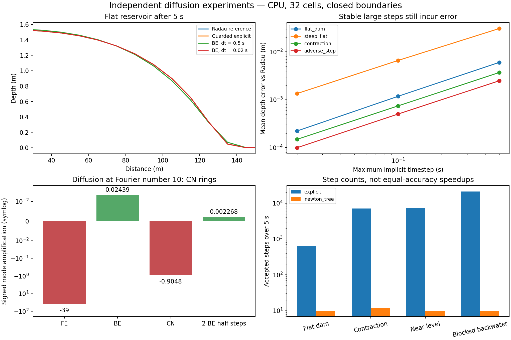

# Diffusive routing: flat-water stiffness and independently tested alternatives

The near-flat restriction is real mathematics of the diffusion-wave approximation. A small discharge can have a very large derivative with respect to water level. The explicit guardrails introduced in the [routing audit](routing-stability-audit.md) suppress the tested instability, but do not remove stiffness, reverse-flow restrictions, or the missing inertia needed for a fast dam break.

This follow-up implemented and ran **90 independent numerical experiments**, analytic checks, and additional production surge regressions. The strongest tested candidate for alleviating stiffness is backward Euler with a conservative nonlinear solve using the D8 tree structure. A second, unregularized flux-variable prototype also works in the tested cases, but freezing conveyance introduces additional error. Neither prototype is a new production routing option.

The final full suite reports **174 passed, 78 skipped**: 76 CUDA parametrizations and two tests requiring external data were skipped. All new experiments ran on **NumPy/SciPy CPU**. CUDA was unavailable; the explicit GPU audit failed with “refusing CPU fallback.” GPU validation remains outstanding. These results do not establish that every possible input or every textbook has been checked.

The isolated GPU-validation branch was additionally tested from a clean checkout: **160 passed, 78 skipped** ([branch test log](assets/diffusive-lab/branch-validation.txt)). Its lower count excludes unrelated, uncommitted tests from the development workspace. Use this clean-checkout baseline for the HPC handoff in `HPC_GPU_VALIDATION_PROMPT.md`.



[Machine-readable results](assets/diffusive-lab/summary.json) · [Profiles](assets/diffusive-lab/profiles.npz) · [Figure PDF](assets/diffusive-lab/results.pdf) · [Test log](assets/diffusive-lab/validation.txt) · [GPU attempt](assets/diffusive-lab/gpu-attempt.txt)

## Why flat water is stiff

Here is a direct derivation for the implemented face law. Let stage be \(\eta=z+h\), face length \(L\), rectangular width \(B\), and storage surface area \(\Omega\). Distinguish storage area from hydraulic cross-section \(A=Bh_f\). Conveyance and the positive head gradient are

\[
K(h_f)=\frac{A R^{2/3}}{n},\qquad R=\frac{Bh_f}{B+2h_f},\qquad
S=\frac{\eta_i-\eta_j}{L}>0,\qquad Q=K\sqrt S.
\]

At fixed conveyance,

\[
g_{ij}=\frac{\partial Q}{\partial(\eta_i-\eta_j)}
=\frac{K}{2L\sqrt S}.
\]

Thus \(Q\to0\) while \(g_{ij}\to\infty\). Two nearly level, wet cells have a very fast numerical relaxation mode even when the hydrograph evolves slowly. This is stiffness, not evidence of a fast physical flood wave. The official [HEC-RAS diffusion-wave equation reference](https://www.hec.usace.army.mil/confluence/rasdocs/hecras/latest/technical-reference/hydraulic-equations/diffusion-wave-equation) explicitly identifies the same singular flat-water limit and the accuracy cost of threshold linearization.

For a wide uniform channel, the tangent diffusivity is

\[
D_{\rm tangent}=\frac{h^{5/3}}{2n\sqrt S},\qquad
\Delta t\lesssim\frac{\Delta x^2}{2D_{\rm tangent}}.
\]

The divergence-form secant coefficient \(h^{5/3}/(n\sqrt S)\) is twice this tangent coefficient for a positive 1-D gradient. Confusing these coefficients produces factor-of-two errors. In more than one spatial direction, the Jacobian is also direction dependent.

On a network, use **all incident edges and the receiving cell's actual storage area**. With a frozen linear conductance, a sufficient explicit positivity bound is

\[
\Delta t\,\frac{\sum_{e\ni i}g_e}{\Omega_i}\le1.
\]

Depth-dependent conveyance adds derivative terms. Multiple tributaries add rates; a narrow receiver can set the bound even when its upstream donors look safe. Halving length and its corresponding rectangular storage area quadruples the near-flat rate. Reducing epsilon by a factor of 100 increases that rate tenfold. Both scalings are tested.

The current production controller uses twice the tangent head conductance and extra conveyance terms, not an exact spectral bound. Above epsilon this equals the Manning secant; at/below epsilon it is twice the regularized linear conductance. It can be more restrictive than necessary, especially on blocked adverse links. This conservatism is separate from the underlying mathematical stiffness.

**An additional production defect was found and fixed in this follow-up.** On a gently descending profile with slope 1e-7, a 1e-8 m alternating depth perturbation had amplification **-0.6999** at `CFL_TARGET=0.85` under the first audit's bound. That is bounded temporal ringing despite positivity. The regularized law's derivative is twice the unregularized derivative evaluated at epsilon, so retaining only the old secant below epsilon loses the intended damping margin. Doubling the rate contribution at/below epsilon changes amplification to **+0.1500**. New CPU/CUDA-parametrized tests check this mode both below and above epsilon. [The failing regression before the fix](assets/diffusive-lab/checkerboard-before.txt) is retained. This linear-mode check is not a universal nonlinear nonoscillation proof.

## Why a positivity limiter is insufficient

The donor-volume limiter prevents exporting more water than exists. It does not prevent exporting enough to reverse a head gradient or create a stage overshoot. Conserving the total volume does not constrain how that volume oscillates between cells. Nor does interval averaging of discharge repair oscillating internal states.

The preceding audit applied the old limiter, smaller timesteps, slope caps, theta blending, synchronous transfers, regularization alone, and combined guards to a reservoir release. The old scheme still had 3.045 m upward depth reversals after reducing the timestep tenfold; the combined guards removed reversals in that flat-reservoir experiment. Those ablations and all four explicit schemes are retained in the [first report](routing-stability-audit.md).

The production regularization is

\[
\phi_\epsilon(S)=\frac{S}{\sqrt{\max(S,\epsilon)}},\quad S\ge0.
\]

It preserves zero discharge at zero gradient, matches Manning above epsilon, and bounds the derivative below epsilon. It is not merely a solver setting: it changes the small-gradient constitutive law. Increasing epsilon to obtain a convenient timestep requires a sensitivity study.

An exact, independently derived two-cell example demonstrates this. With constant \(K=10\), \(\Omega=100\), \(L=10\), and initial head difference \(\delta_0=10^{-4}\) m,

\[
\delta(t)=\left[\max\left(\sqrt{\delta_0}-
\frac{K t}{\Omega\sqrt L},0\right)\right]^2
\]

for the unregularized law. It reaches zero in about 0.316 s. Below the regularization threshold \(L\epsilon\), decay instead becomes exponential. At one second:

| Epsilon | Remaining head difference (m) |
|---|---:|
| Unregularized | 0 |
| 1e-2 | 8.1873e-5 |
| 1e-4 | 1.3534e-5 |
| 1e-6 | 1.5568e-12 |
| 1e-8 | 5.4917e-68 |

The exact formula is checked against a separate scalar Radau integration, including the transition between square-root and linear regimes. A large epsilon can substantially delay equilibration despite producing a smooth, conservative result.

## Experiments and independent checks

`tools/diffusive_independent_lab.py` imports no MRRpy kernels. It implements rectangular face fluxes, their analytic Jacobian, conservative transfers, and four integration paths:

- Explicit Euler with an analytic-Jacobian rate bound and donor-volume bound.
- Fully nonlinear backward Euler with damped Newton and tree elimination.
- The same nonlinear equations solved with SciPy sparse linear algebra.
- An unregularized flux-variable method with lagged conveyance and coordinate minimization.

SciPy Radau provides a different time-integration algorithm for the independently implemented equations. It shares the lab's flux law, so agreement alone is not an independent validation of that law. Separate checks compare the face law with production, differentiate it numerically, compare tree solves with dense algebra on random nonsymmetric forests, and exercise analytic scalar and Fourier-mode oracles. See [SciPy's solver documentation](https://docs.scipy.org/doc/scipy/reference/generated/scipy.integrate.solve_ivp.html) for Radau's method.

The main sweep uses 32 cells, 10 m lengths, width 10 m, Manning n=0.03, five simulated seconds, and closed boundaries. Reservoir cases initially contain 2 m over the first quarter of cells. The steep-flat transition, tenfold width contraction, and 1 m adverse bed step are placed **at the initial wetting front**, so those features are actually exercised. Other cases cover four-branch confluence, a lake at rest over uneven terrain, nearly level water, and a downstream reservoir with directed versus signed links. Separate tests keep a pool below an adverse lip to check that it cannot cross it.

Each case uses explicit stepping and three timestep ceilings (0.5, 0.1, 0.02 s) for each alternative: 90 runs. The Radau reference uses relative/absolute tolerances 1e-9/1e-11, with an additional 1e-10/1e-12 check. The largest resulting change in any final cell depth was **2.63e-10 m**. This is temporal verification on the chosen spatial discretization, not a continuum convergence or real-flood validation claim.

| Case | Explicit steps | BE steps, 0.5 s ceiling | Rejected BE trials | BE mean depth error at 0.5 s (m) | BE error at 0.02 s (m) |
|---|---:|---:|---:|---:|---:|
| Flat reservoir | 649 | 10 | 0 | 0.006020 | 0.0002223 |
| Steep to flat | 73 | 10 | 0 | 0.03067 | 0.001345 |
| Width contraction | 7101 | 12 | 6 | 0.003695 | 0.0001488 |
| Confluence | 380 | 10 | 0 | 0.004492 | 0.0002236 |
| Adverse bed step | 1561 | 10 | 0 | 0.002484 | 0.00009944 |
| Lake at rest | 38014 | 10 | 0 | 4.44e-14 | 4.44e-14 |
| Nearly level | 7380 | 10 | 0 | 9.29e-9 | 1.03e-9 |
| Directed backwater | 21141 | 10 | 0 | 0 | 0 |
| Signed backwater | 2881 | 10 | 0 | 0.004305 | 0.0001678 |

Across the 90 runs, minimum depth was nonnegative and maximum absolute volume discrepancy was **3.52e-12 m³**. Accepted nonlinear BE steps satisfied a continuity residual below 1e-10 m when divided by storage area. Tree and sparse results agree to floating-point precision in the checked cases.

These step counts are **not equal-accuracy speedups**. For example, the flat explicit solution's mean depth error is 0.0001328 m, while ten large BE steps give 0.006020 m. Wall times in the JSON describe small CPU prototypes, not optimized basin-scale or GPU implementations. Near-level errors stop decreasing monotonically once nonlinear stopping tolerance becomes significant: the 0.1 s error is 1.95e-10 m, lower than at 0.02 s. Smaller timesteps alone do not overcome a fixed solve tolerance.

Two stationary cases reveal avoidable work as well as stiffness. The independent explicit algorithm still takes thousands of steps when the state is unchanged. A verified zero residual can permit a stationary fast path in a closed, unforced calculation. Production forcing and boundary events must be accounted for before applying such a shortcut; it has not been added to production.

## Implicit D8 routing does not require a general sparse solve

For an acyclic graph with one downstream neighbor per cell, the undirected connectivity is a tree or forest. A Newton Jacobian has only diagonal and parent-child entries. Eliminate a leaf \(i\) with parent \(j\):

\[
d_j\leftarrow d_j-\frac{\ell_i u_i}{d_i},\qquad
b_j\leftarrow b_j-\frac{\ell_i b_i}{d_i}.
\]

Process leaves toward roots, solve roots, then back-substitute
\(x_i=(b_i-u_i x_j)/d_i\). No fill appears between siblings. Each edge is processed once: **O(N) per linear solve**, even with nonsymmetric edge entries. This derivation requires an appropriate nonsingular system; the tested hydraulic Jacobians have positive storage and M-matrix structure. Cycles and general multiple-direction meshes invalidate the simple tree algorithm.

The earlier educational claim that confluences necessarily require an expensive general sparse solve was wrong and has been corrected. Tree-based implicit solvers are also used in other fields; [Huber's GPU Hines-matrix study](https://arxiv.org/abs/1810.12742) provides an example of GPU tree algorithms. Applying that structure to D8 is our algebraic inference, not a hydrological validation or measured GPU speedup from that paper.

The contraction test is an important counterexample to “implicit means any timestep works.” The initial 0.5 s Newton solve fails its line search. Rejecting and halving the step recovers; the full run rejects six trials. A regression test requires detection and recovery. A production implementation needs residual checks, positivity-preserving trial acceptance, a retry budget, and failure reporting, as well as accuracy and forcing-resolution controls. [HEC-RAS's diffusion solver reference](https://www.hec.usace.army.mil/confluence/rasdocs/ras1dtechref/6.6/theoretical-basis-for-one-dimensional-and-two-dimensional-hydrodynamic-calculations/2d-unsteady-flow-hydrodynamics/numerical-methods/diffusion-wave-equation-solver) likewise describes a volume-stage nonlinear system and iterative solution; its hydraulic-property treatment is not identical to this prototype.

## Other solutions actually applied

**Unregularized flux variables.** Instead of differentiating a square-root head law, solve for the face discharge. With incidence matrix \(C\), storage matrix \(M\), and old-state conveyance \(K^n\), the prototype solves

\[
\frac{L_e q_e|q_e|}{(K_e^n)^2}
+\Delta t\,[C^T M^{-1}Cq]_e=[C^T\eta^n]_e.
\]

This removes the square-root singularity from the unknown's constitutive term. Directed links impose \(q\ge0\); signed links allow either direction. Zero-conveyance faces remain closed for that step. Exact coordinate minimization checks the projected KKT residual to 1e-9 m; continuity then uses each flux once with opposite signs. Failed or negative-depth steps are rejected.

This is **semi-implicit with frozen conveyance**, not fully nonlinear backward Euler. A generic L-BFGS attempt initially failed the tight residual criterion near dry fronts; the final coordinate method passed this sweep. It has no slope epsilon, but reference comparisons use epsilon=1e-10 as an approximation to the unregularized law, not an exact unregularized oracle. At 0.02 s, flat-reservoir error against that reference is about 0.0001937 m; contraction error is about 0.0004684 m. Refinement improves both, but the method's front delay and lagged-conveyance error need attention. It is not yet a production recommendation ahead of fully nonlinear BE.

**Crank–Nicolson and damping startup.** A periodic linear-diffusion checkerboard with Fourier number \(F=D\Delta t/\Delta x^2=10\) has exact mode multiplier \(e^{-40}\). The separately solved matrix experiment gives:

| Time integration | Measured mode multiplier | Result |
|---|---:|---|
| Forward Euler | -39 | Unstable; negative depth |
| Backward Euler | 1/41 | Strong damping, no sign reversal |
| Crank–Nicolson | -19/21 | Bounded but oscillatory |
| Two BE half steps | 1/441 | Strong startup damping |

These match the analytic amplification factors. They explain why simply replacing explicit Euler with Crank–Nicolson may preserve ringing. The two half steps test the damping mechanism used in Rannacher startup; a complete switched nonlinear CN router is **not** implemented. The accessible [Langtangen–Linge diffusion textbook chapter](https://hplgit.github.io/fdm-book/doc/pub/book/sphinx/._book011.html) and [Hairer–Wanner stiff-equation lecture](https://www.unige.ch/~hairer/preprints/coimbra.pdf) support the distinction between stability and damping. For uniform linear diffusion, FE needs \(F\le1/2\) for boundedness; avoiding sign reversal of every Fourier mode requires \(F\le1/4\).

**Reverse flow.** Directed backwater remains exactly stationary although the downstream reservoir should wet upstream cells. Signed links do wet those cells in the independent test. No timestep, epsilon, or implicit solver can fix the physical restriction imposed by clipping negative discharge to zero. Signed D8 links still do not provide arbitrary two-dimensional floodplain connectivity.

**Full momentum for fast releases.** The previous audit implemented a full shallow-water HLL experiment and checked refinement against the frictionless Ritter dam-break solution. That is a different model, necessary to test a fast release's inertia. It is not interchangeable with either diffusion wave or the production local-inertia option, which omits advective momentum. [USACE dam-breach guidance](https://www.hec.usace.army.mil/confluence/rasdocs/hgt/latest/tutorials/2d-unsteady-flow/dam-breach-analysis-with-2d-areas) recommends assessing the momentum terms for rapidly rising breach waves. A stable diffusive hydrograph alone is insufficient validation.

Local timestep subcycling, super-time-stepping, IMEX, multigrid, and NCZ variants have not been implemented in this follow-up. They are not presented as tested fixes. Conservation across asynchronous interfaces and monotonicity would require their own tests.

## Production surge and repository findings

The current `tests/_surge_case.py` sets a 20 m channel width but leaves `CHANNEL_ROUTING=False`, so the existing benchmark uses the overland cross-section. I preserved that fixture and explicitly tested both settings in `tests/test_surge_diffusive_guards.py`.

For the 50 m³/s, 30-minute pulse, the diffusive gauge peak ratios at rows 40/70/100 were approximately **0.995/0.970/0.899** with channels disabled and **0.993/0.964/0.898** with channels enabled. The added regressions check finite nonnegative discharge, bounded peaks, mass closure below 1e-10 relative, and total variation consistent with a single pulse. These are 30-second interval hydrographs; the separate internal-field audit remains necessary. [Surge results](assets/diffusive-lab/surge.json) and both raw CSVs are saved alongside the lab outputs.

The existing surge test's prose about persistent 10–110 m³/s diffusive oscillations describes older behavior; it is not reproduced by the current guarded run. Its dynamic-versus-kinematic arrival comparison is a numerical comparison, not an independent shallow-water reference.

The [search inventory](assets/diffusive-lab/search-inventory.txt) lists 53 matching source, test, documentation, and educational files before this report was added. The executable diffusion path is concentrated in `MRRpy/core/routing/hydraulics.py`, `router.py`, `schemes.py`, and `MRRpy/config.py`, with terrain geometry and shared GPU operations also covered by the preceding audit. Search coverage is not a claim of formal verification of every matching line.

Corrections made in this follow-up:

- Strengthened the production timestep bound at/below the regularization threshold and added a checkerboard regression. This reduces the step in that regime; it does not change the discharge law.
- Removed legacy configuration claims that diffusion has no spatial-squared timestep restriction, that a limiter guarantees stability, and that a timestep floor may override the bound. Scenario values were preserved.
- Replaced Chapter 5's obsolete steepest-bed-only timestep explanation and incorrect general-sparse-solve claim.
- Labeled historical educational widgets as simplified examples instead of current production source.
- Corrected methods/paper claims that the local-inertia option preserves general dam-break shocks.

Other educational widgets remain illustrations and are not independently validated copies of the production router. The study frontend's dependencies were absent, so a frontend build was not run; this follow-up changed prose and labels, not its numerical JavaScript algorithms.

## Guardrails and the decision supported by these tests

For the current explicit diffusive option, retain true stage differences, zero dry conveyance, synchronous conservative transfers, incident-edge diffusion and conveyance rate bounds using real storage areas, a donor-volume limiter, and a safe timestep that cannot be raised by `CFL_DT_MIN`. Retain finite-value checks and diagnostics for clipping, small timesteps, volume closure, and internal oscillation. Check timestep, grid, precision, and epsilon sensitivity for the intended event. These are necessary safeguards; this test matrix is not a universal stability or physical-validity proof.

For an implicit production option, the tested next implementation is backward Euler with tree elimination, residual-based nonlinear stopping, negative-trial rejection, step retry, and accuracy control. It must also integrate forcing discontinuities, free outflow, channel geometry, field recording, and mass accounting, followed by real CUDA testing. The lab's closed rectangular networks do not cover those production integration requirements.

For the user's fast dam break, retain full-momentum validation as a separate requirement. A smooth result from a more robust diffusive solver does not restore omitted inertia. Ponce's [primary discussion of wave-model applicability](https://ponce.sdsu.edu/modeling_surface_runoff_with_kinematic_diffusion_and_dynamic_waves.html) also emphasizes event timescale and flow regime, not just bed slope.

## Reproduction and source-access limits

From the repository root with project dependencies and pytest installed:

```sh
python tools/diffusive_independent_lab.py --output /tmp/diffusive-lab
python tools/plot_diffusive_lab.py /tmp/diffusive-lab
python -m pytest tests/test_diffusive_independent.py tests/test_surge_diffusive_guards.py -q
python -m pytest -q
python tools/routing_stability_audit.py --backend gpu --output /tmp/routing-gpu
PYMRR_REQUIRE_GPU=1 python -m pytest tests/test_routing_stability.py -q
```

The GPU commands intentionally fail when no CUDA device is available. All four explicit schemes were rerun after the final guard change: six adversarial geometries in float32 and float64, **48 production runs**, saved in [production-final.json](assets/diffusive-lab/production-final.json). All returned finite values, but finiteness and mass closure alone do not imply validity:

| Scheme | Lowest storage (m³) | Worst relative mass error, float64 | Worst relative mass error, float32 | Largest fraction of wet cells limited in a step |
|---|---:|---:|---:|---:|
| Kinematic | 0 | 4.55e-16 | 3.05e-7 | 0 |
| Diffusive | 0 | 3.07e-15 | 1.03e-5 | 0 |
| Muskingum–Cunge | **-147.60** | 1.14e-15 | 3.27e-7 | 0 (different ledger/update) |
| Local inertia (`dynamic`) | 0 | 9.10e-16 | 1.16e-7 | **33.3%** |

MC negative storage, float32 accumulation error, and local-inertia clipping/timestep sensitivity remain open. Passing diffusive tests does not resolve them. The GPU parametrizations remain unexecuted on this machine.

Sources were checked directly where accessible: the Langtangen–Linge textbook's diffusion chapter, Hairer–Wanner's 17-page author lecture, USACE equation/solver/dam-breach references, and Ponce's author-hosted paper. LeVeque's [chapter 9 companion page](https://faculty.washington.edu/rjl/fdmbook/chapter9.html) was located, but it is not the full textbook. Casulli–Zanolli publication records were found; restricted full texts were not treated as read. This is a targeted primary-source review with reproducible derivations and experiments, not a claim to have read all textbooks.
