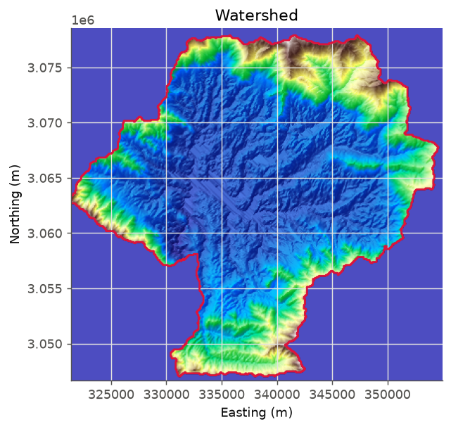
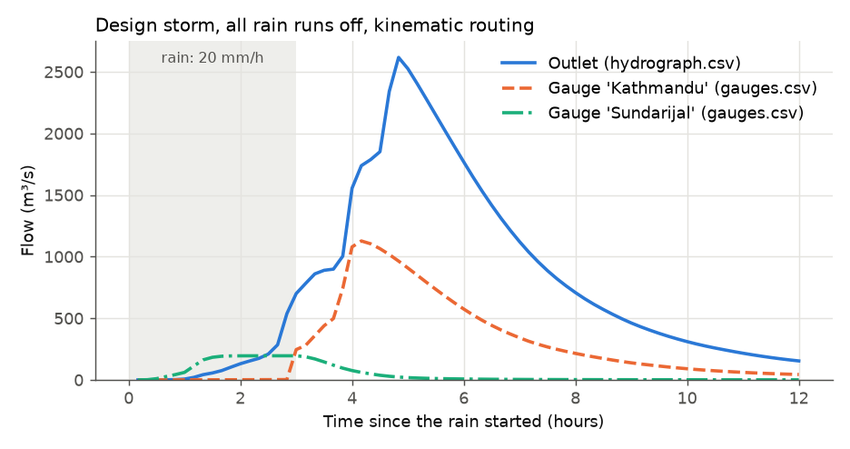

# 1 Your first run

**Goal:** route a simple design storm over a basin, from your own DEM, and get
the flood hydrograph at the outlet and at two points upstream.

**You need:** a DEM GeoTIFF covering the basin (here `dem.tif`, 90 m) and the
latitude and longitude of the outlet. No internet, no Earth Engine.

**Settings used:** [[DEM_PATH]], [[OUTPUT_POINT]], [[TARGET_CRS_EPSG]],
[[OUTPUT_DIR]], [[PRECIP_METHOD]], [[RAIN_INTENSITY_MM_HR]],
[[RAIN_DURATION_HOURS]], [[RUNOFF_SOURCE]], [[ROUTING_SCHEME]],
[[TOTAL_SIMULATION_TIME_HOURS]], [[ROUTING_GAUGES]].

The storm: 20 mm/h for 3 hours (60 mm) on every cell. All of it runs off
(`RUNOFF_SOURCE: none`), so this is the largest flood that storm can make. The
water is routed with the kinematic wave for 12 hours.

## Set it up

=== "Notebook form"

    ```python
    from MRRpy import ConfigForm
    form = ConfigForm()
    form
    ```

    1. **Terrain**: *I have a DEM file* → `dem.tif`. *Area to model*: *the
       watershed*, outlet `27.632222, 85.293333`. Results folder
       `results/first_run/`.
    2. **Coordinate system**: press **Use the outlet's UTM zone**
       (`EPSG:32645`).
    3. **Precipitation**: *Design storm*, rain intensity `20`, duration `3`.
    4. **Runoff**: `none`.
    5. **Routing**: `kinematic`, simulation length `12`.
    6. **Outputs and run**: *Virtual gauges*, one per line:
       `Sundarijal, 27.76, 85.42` and `Kathmandu, 27.70, 85.32`. Then **Check
       settings** and **Run the model**.

=== "Config file + CLI"

    Save as `run.yaml` (or start from `MRRpy init-config --short -o run.yaml`, or
    answer the questions of `MRRpy wizard`):

    ```yaml
    DEM_PATH: dem.tif
    OUTPUT_POINT: [27.632222, 85.293333]
    TARGET_CRS_EPSG: EPSG:32645
    OUTPUT_DIR: results/first_run/
    PRECIP_METHOD: uniform
    RAIN_INTENSITY_MM_HR: 20.0
    RAIN_DURATION_HOURS: 3.0
    RUNOFF_SOURCE: none
    ROUTING_SCHEME: kinematic
    TOTAL_SIMULATION_TIME_HOURS: 12.0
    ROUTING_GAUGES:
      - {name: Sundarijal, lat: 27.76, lon: 85.42}
      - {name: Kathmandu, lat: 27.70, lon: 85.32}
    ```

    ```bash
    MRRpy validate -c run.yaml     # checks it and says in words what the run will do
    MRRpy run -c run.yaml
    ```

=== "Python"

    ```python
    from MRRpy import Config, run_pipeline, plot_hydrograph, plot_watershed

    cfg = Config(
        DEM_PATH="dem.tif",
        OUTPUT_POINT=(27.632222, 85.293333),     # (latitude, longitude)
        TARGET_CRS_EPSG="EPSG:32645",
        OUTPUT_DIR="results/first_run/",
        PRECIP_METHOD="uniform",
        RAIN_INTENSITY_MM_HR=20.0,
        RAIN_DURATION_HOURS=3.0,
        RUNOFF_SOURCE="none",
        ROUTING_SCHEME="kinematic",
        TOTAL_SIMULATION_TIME_HOURS=12.0,
        ROUTING_GAUGES=[{"name": "Sundarijal", "lat": 27.76, "lon": 85.42},
                        {"name": "Kathmandu", "lat": 27.70, "lon": 85.32}],
    )
    out = run_pipeline(cfg)              # process_dem, then routing
    plot_watershed(out)
    plot_hydrograph(out)
    ```

=== "QGIS plugin"

    Open **Plugins → MRRpy_plugin**.

    1. Tab **1 · DEM & Watershed**: *DEM file* `dem.tif`, *Target CRS*
       `EPSG:32645`, **Analyze terrain**. Under *Area to model* keep *Watershed
       above an outlet point*, type the latitude and longitude (or **Pick on
       map**), **Delineate watershed**. *Output directory* `results/first_run/`.
    2. Tab **2 · Precipitation**: *Uniform (constant rate)*, *Rainfall intensity*
       20 mm/h, *Rainfall duration* 3 h.
    3. Tab **3 · Runoff**: *None — all rainfall is runoff*.
    4. Tab **4 · Routing**: *Scheme* `kinematic`, *Simulation duration* 12 h.
    5. **Run**. Tab **5 · Results** shows the hydrograph.

    The dialog has no field for virtual gauges: save the YAML above and open it
    with **Load Config** to include them.

## Results

{ width="520" }



- The basin is **606 km²** (74,795 cells of 90 m). The storm puts
  36.4 million m³ of water on it.
- The outlet peaks at **2,617 m³/s, 4.8 hours** after the rain started, about
  2 hours after it stopped: the time the water takes to reach the outlet.
- The gauges peak earlier and lower: Sundarijal is near the top of the basin.
- After 12 hours, 33.2 million m³ have left the basin and 3.1 million are still
  on their way. The water-balance error is about 10⁻¹⁵, machine precision
  (`mass_balance.csv`).

The run writes `hydrograph.csv`, `gauges.csv`, `mass_balance.csv` and the terrain
files to `results/first_run/` ([what each file holds](../manual/outputs.md#67-files-a-run-writes)).
It took 18 seconds on one CPU.

## Other options to try

| Change | Setting | See |
|---|---|---|
| a longer, weaker storm | `RAIN_INTENSITY_MM_HR: 10`, `RAIN_DURATION_HOURS: 6` | [3.2](../manual/precipitation.md#32-design-storm) |
| let rain soak in | `RUNOFF_SOURCE: scs_cn` or `physical` | [Example 4](runoff-methods.md) |
| another routing method | `ROUTING_SCHEME: diffusive_implicit` | [Example 3](routing-schemes.md) |
| a coarser, faster grid | `DEM_SCALE_M` on a download, or resample your DEM | [1.1](../manual/terrain.md#11-elevation-data-dem) |
| the GPU | `BACKEND: gpu` | [6.4](../manual/outputs.md#64-computer-cpu-or-gpu) |
| rerun routing only | `MRRpy run -c run.yaml --stages routing` | [6.6](../manual/outputs.md#66-running) |
