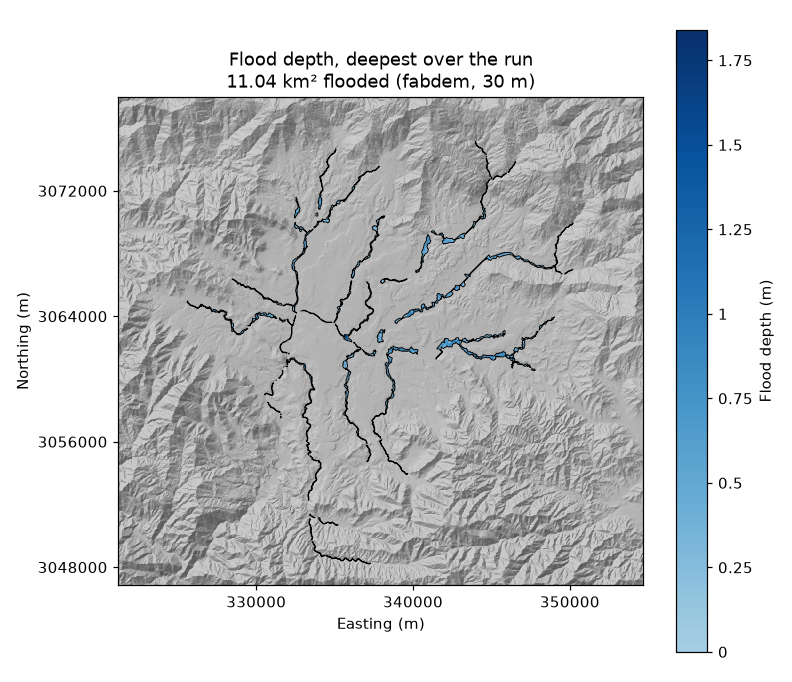
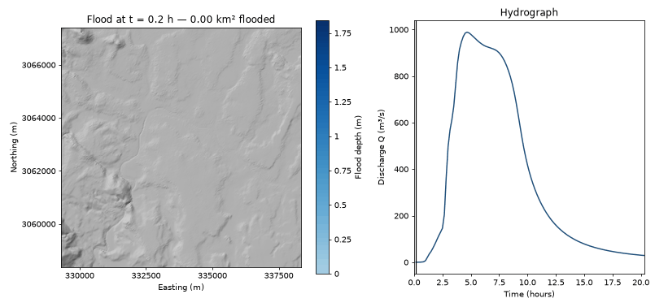

# 12 Flood depth and extent maps

**Goal:** see how far the rivers spread in a flood: maps of flood depth and
extent, an animation, and tables per river reach, drawn at 30 m while the model
runs at 90 m.

**You need:** an Earth Engine sign-in and project ([setup](../manual/earth-engine.md))
and `pip install "MRRpy[gee]"`, for the DEM and its finer copy. With your own
DEM instead, see *Other options to try*.

**Settings used:** [[INUNDATION_MAP]], [[INUNDATION_DEM]], [[INUNDATION_AREA]],
[[INUNDATION_ANIMATION]], [[DEM_SOURCE]], [[DEM_SCALE_M]], [[CHANNEL_QBF_M3S]].

The storm: 15 mm/h for 3 hours on the Bagmati above Khokana, all of it running
off (`RUNOFF_SOURCE: none`). The terrain is FABDEM (bare earth: buildings and
trees removed) averaged to 90 m, and the river channels are sized for the
2-year flood with the Nepal formula (`wecs_nepal`). With `INUNDATION_DEM: auto`
the flood maps use FABDEM at its own 30 m.

## Set it up

=== "Notebook form"

    1. **Terrain**: *Download a DEM for an area*, area `85.1, 27.5, 85.6, 27.9`,
       *DEM dataset* `fabdem`, *Download resolution* `90`. Outlet
       `27.632222, 85.293333`, results folder `results/flood_maps/`. Connect to
       Earth Engine.
    2. **Coordinate system**: **Use the outlet's UTM zone**.
    3. **Precipitation**: *Design storm*, `15` mm/h for `3` h.
    4. **Runoff**: `none`.
    5. **Routing**: `diffusive_implicit`, simulation length `24`. Under *River
       channels*, *Bankfull flow*: formula `wecs_nepal`.
    6. **Outputs and run**: tick *Flood depth and extent maps*; *Elevation data
       for the flood maps* `auto`; keep *Flood animation (GIF)* ticked. Then
       **Run the model**.

=== "Config file + CLI"

    ```yaml
    DEM_PATH: ''
    DEM_BOUNDS_WGS84: [85.1, 27.5, 85.6, 27.9]
    DEM_SOURCE: fabdem
    DEM_SCALE_M: 90.0
    GEE_PROJECT: ee-yourname
    OUTPUT_POINT: [27.632222, 85.293333]
    TARGET_CRS_EPSG: EPSG:32645
    OUTPUT_DIR: results/flood_maps/
    RAIN_INTENSITY_MM_HR: 15.0
    RAIN_DURATION_HOURS: 3.0
    RUNOFF_SOURCE: none
    ROUTING_SCHEME: diffusive_implicit
    TOTAL_SIMULATION_TIME_HOURS: 24.0
    CHANNEL_QBF_M3S: wecs_nepal
    MANNINGS_N: 0.06
    MANNINGS_N_CHANNEL: 0.035
    INUNDATION_MAP: true
    INUNDATION_DEM: auto
    ```

    ```bash
    MRRpy run -c flood.yaml
    # later: other area or DEM, without routing again
    MRRpy run -c flood.yaml --stages inundation
    ```

=== "Python"

    ```python
    from MRRpy import Config, run_pipeline, plot_inundation, animate_inundation

    cfg = Config(
        DEM_PATH="", DEM_BOUNDS_WGS84=(85.1, 27.5, 85.6, 27.9),
        DEM_SOURCE="fabdem", DEM_SCALE_M=90.0, GEE_PROJECT="ee-yourname",
        OUTPUT_POINT=(27.632222, 85.293333), TARGET_CRS_EPSG="EPSG:32645",
        OUTPUT_DIR="results/flood_maps/",
        RAIN_INTENSITY_MM_HR=15.0, RAIN_DURATION_HOURS=3.0, RUNOFF_SOURCE="none",
        ROUTING_SCHEME="diffusive_implicit", TOTAL_SIMULATION_TIME_HOURS=24.0,
        CHANNEL_QBF_M3S="wecs_nepal", MANNINGS_N=0.06, MANNINGS_N_CHANNEL=0.035,
        INUNDATION_MAP=True,                 # flood depth and extent maps
        INUNDATION_DEM="auto",               # FABDEM at 30 m for the maps
    )
    out = run_pipeline(cfg)

    plot_inundation(out)                                         # the whole basin
    plot_inundation(out, area=(85.27, 27.64, 85.36, 27.72))     # central Kathmandu
    animate_inundation(out, area=(85.27, 27.64, 85.36, 27.72),
                       out_path="kathmandu_flood.gif")
    ```

=== "QGIS plugin"

    1. Tab **1 · DEM & Watershed**: download FABDEM at 90 m for the area above
       and delineate the watershed at the outlet.
    2. Tab **2 · Precipitation**: *Uniform*, 15 mm/h for 3 h. Tab **3 ·
       Runoff**: *None*.
    3. Tab **4 · Routing**: `diffusive_implicit`, 24 h; in *Flood Depth and
       Extent Maps (HAND)* tick *Make flood depth and extent maps*, keep
       *Elevation data for the maps* on `auto`.
    4. **Run**. On tab **5 · Results**, **Load Flood Maps** adds the depth and
       the flooded area; **Open Flood Animation** plays the GIF.

## Results

{ width="560" }

*`plot_inundation(out)`: the deepest water each place reached, outlined in
black, over the relief.*



*`animate_inundation(out, area=…)`: the frames follow the largest flood; the
title gives the time and the flooded area in view.*

- The outlet peaks at **989 m³/s**, 4.7 hours after the rain started: about
  1.9 times the bankfull flow of 522 m³/s that the channel is sized for.
- On FABDEM at 30 m, **11.0 km²** are flooded, at most **1.8 m** deep; 192 of the
  197 river reaches go above their banks. Drawn on the 90 m model grid
  (`INUNDATION_DEM: model_grid`) the same flood covers 14.2 km²: the coarser
  cells blur the river banks.
- The main Bagmati stays mostly in its deep channel through the city; the water
  spreads where the banks are low, along the side rivers of the valley floor.
- The run writes the maps, `flood_animation.gif`, `reaches.csv` and
  `rating_curves.csv` to `results/flood_maps/inundation/`
  ([what each file holds](../manual/outputs.md#63-flood-depth-and-extent-maps)).
  The routing took 38 seconds; the 30 m maps a few seconds more, after the
  one-time download.

How the maps are made: every cell is linked to the river it drains to, and each
1 km river reach gets a rating curve from the model's own channel plus the land
beside it. The reach's peak flow gives its water level, and everything lower is
flooded. On the 30 m DEM each river takes the flow of the routed 90 m river
nearby that drains the same area; here 100 % of the 30 m river cells in the
basin found one. See [6.3](../manual/outputs.md#63-flood-depth-and-extent-maps).

!!! note "Checked against a real gauge"
    At Khokana the Department of Hydrology and Meteorology's rating rises 2.2 m
    between 100 and 500 m³/s. The rating curve this method builds there (no
    calibration) rises 1.5 m on the 30 m map and 1.75 m on the 90 m map: two
    thirds to four fifths of it. The gauge is 2 km above the Chobhar gorge,
    whose narrowing backs floods up; the method assumes flow is not held back
    from downstream, so just above narrow gorges and bridges it will draw floods
    too shallow.

## Other options to try

| Change | Setting | See |
|---|---|---|
| only one town or valley (faster on a fine DEM) | `INUNDATION_AREA: [85.27, 27.64, 85.36, 27.72]` | [6.3](../manual/outputs.md#63-flood-depth-and-extent-maps) |
| your own fine DEM, e.g. LiDAR | `INUNDATION_DEM: file`, `INUNDATION_DEM_PATH: lidar.tif` | [6.3](../manual/outputs.md#63-flood-depth-and-extent-maps) |
| maps on the model grid, no download | `INUNDATION_DEM: model_grid` | [6.3](../manual/outputs.md#63-flood-depth-and-extent-maps) |
| a real storm | `PRECIP_METHOD: imerg_thiessen` | [Example 7](satellite-storm.md) |
| redraw the maps without routing | `MRRpy run -c flood.yaml --stages inundation` | [6.6](../manual/outputs.md#66-running) |
