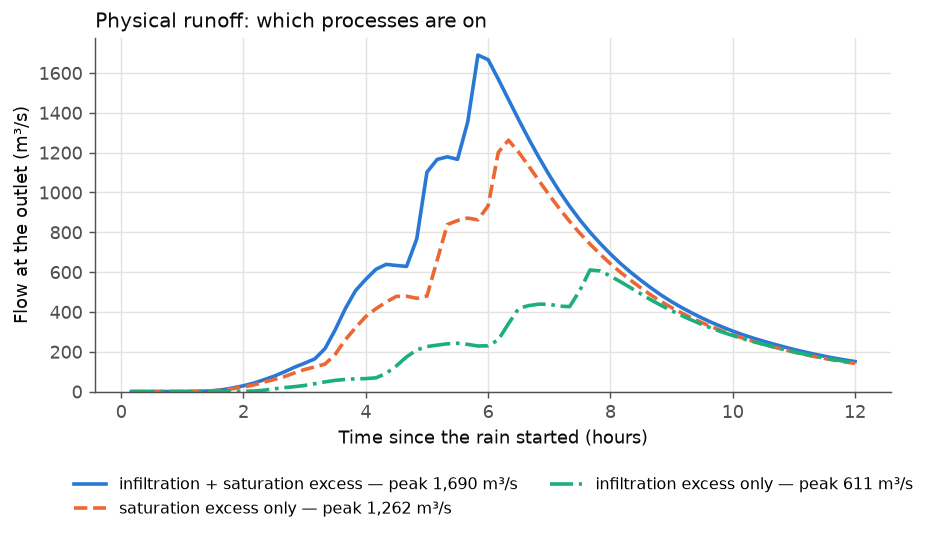

# 5 Physical runoff processes

**Goal:** use the physical runoff method and see what each process adds. The
same 75 mm storm as in [Example 4](runoff-methods.md) falls three times, with
different processes ticked:

| Run | `RUNOFF_MECHANISMS` |
|---|---|
| infiltration excess only | `[infiltration_excess]` |
| saturation excess only | `[saturation_excess]` |
| both | `[infiltration_excess, saturation_excess]` |

The soil values are the same in all three runs and are typed in, so no data are
needed: Green–Ampt $K_v$ = 12 mm/h and $\psi$ = 0.15 m; soil storage 0.10 m,
drainable porosity 0.35, sideways conductivity 44 m/day, river flow before the
storm 10 m³/s.

**Settings used:** [[RUNOFF_SOURCE]], [[RUNOFF_MECHANISMS]], [[GA_KSAT_MMHR]],
[[GA_SUCTION_M]], [[VSA_SD_MAX_INITIAL]], [[VSA_PHI]], [[VSA_K_SAT]],
[[VSA_Q_MAX]].

## Set it up

=== "Notebook form"

    **4 Runoff** → `physical`. Tick the processes; each tick box opens its own
    settings underneath:

    - *infiltration_excess*: *Soil infiltration rate* `12`, *Soil suction head*
      `0.15`.
    - *saturation_excess*: *Root-zone depth* `0.1`, *Drainable porosity* `0.35`,
      *Sideways soil conductivity* `44`, *River flow before the storm* `10`.

    *Soil storage from* stays `manual` (the typed values).

=== "Config file + CLI"

    ```yaml
    DEM_PATH: dem.tif
    OUTPUT_POINT: [27.632222, 85.293333]
    TARGET_CRS_EPSG: EPSG:32645
    OUTPUT_DIR: results/physical_both/
    RAIN_INTENSITY_MM_HR: 25.0
    RAIN_DURATION_HOURS: 3.0
    TOTAL_SIMULATION_TIME_HOURS: 12.0
    RUNOFF_SOURCE: physical
    RUNOFF_MECHANISMS: [infiltration_excess, saturation_excess]
    GA_KSAT_MMHR: 12.0
    GA_SUCTION_M: 0.15
    VSA_SD_SOURCE: manual
    VSA_SD_MAX_INITIAL: 0.10
    VSA_PHI: 0.35
    VSA_K_SAT: 44.0
    VSA_Q_MAX: 10.0
    ```

    ```bash
    MRRpy run -c physical_both.yaml
    ```

=== "Python"

    ```python
    from MRRpy import Config, run_pipeline, plot_mass_balance

    soil = dict(GA_KSAT_MMHR=12.0, GA_SUCTION_M=0.15, VSA_SD_MAX_INITIAL=0.10,
                VSA_PHI=0.35, VSA_K_SAT=44.0, VSA_Q_MAX=10.0)
    for name, mech in {"infiltration": ["infiltration_excess"],
                       "saturation": ["saturation_excess"],
                       "both": ["infiltration_excess", "saturation_excess"]}.items():
        cfg = Config(DEM_PATH="dem.tif", OUTPUT_POINT=(27.632222, 85.293333),
                     TARGET_CRS_EPSG="EPSG:32645", OUTPUT_DIR=f"results/physical_{name}/",
                     RAIN_INTENSITY_MM_HR=25.0, RAIN_DURATION_HOURS=3.0,
                     TOTAL_SIMULATION_TIME_HOURS=12.0,
                     RUNOFF_SOURCE="physical", RUNOFF_MECHANISMS=mech, **soil)
        out = run_pipeline(cfg)

    plot_mass_balance(out)       # the last run: input, outflow, storage, error
    ```

=== "QGIS plugin"

    Tab **3 · Runoff** → *Mode* **Physical — composable mechanisms**. Tick
    *Infiltration-excess (Green-Ampt / Horton)* and/or *Saturation-excess
    (VSA-OPM / Dunne)*; the groups *Infiltration-Excess (Green-Ampt)* and
    *Saturation-Excess Parameters* appear. Fill in the values above (*SD_max
    initial* 0.1 m, *Q_max* 10 m³/s, *phi* 0.35, *K_sat (lateral)* 44 m/day).

## Results



| Run | Runoff ÷ rain | Peak (m³/s) | Peak at (h) | Runoff from saturation / infiltration excess |
|---|---|---|---|---|
| infiltration excess only | 0.27 | 611 | 7.7 | 0 % / 100 % |
| saturation excess only | 0.44 | 1,263 | 6.3 | 100 % / 0 % |
| both | 0.55 | 1,690 | 5.8 | 76 % / 24 % |

The split by process is in the `dunne_frac` and `horton_frac` columns of
`mass_balance.csv`, and over time in `partition.csv`.

What to notice:

- **Each process runs off rain in different places.** Saturation excess sheds
  all the rain on the valley floors and near the rivers, where the soil fills
  first. Infiltration excess sheds part of the rain wherever it falls faster
  than the soil takes it in.
- **Together they make more runoff than either alone**, but never count water
  twice: on each cell the larger of the two applies
  ([how they combine](../manual/runoff.md#46-physical-runoff)).
- **With both on, the soil store fills more slowly.** Only the water that soaks
  in refills it; the rest has already run off as infiltration excess. So
  saturation excess makes a little less runoff (18.9 million m³ instead of
  20.0 million m³) than when it runs alone.

## Other options to try

| Change | Setting | See |
|---|---|---|
| a wetter start | `VSA_Q_MAX: 50` (more of the basin starts saturated) | [4.6.3](../manual/runoff.md#463-saturation-excess-vsa-opm) |
| more soil storage | `VSA_SD_MAX_INITIAL: 0.3` | [4.6.3](../manual/runoff.md#463-saturation-excess-vsa-opm) |
| urban areas | add `impervious` with `IMPERVIOUS_SOURCE: lulc` (Earth Engine) or `raster` | [4.6.1](../manual/runoff.md#461-impervious-areas) |
| soil from satellite for the storm date | `VSA_SD_SOURCE: gee`, `EVENT_START_UTC` | [4.6.5](../manual/runoff.md#465-soil-from-satellite-data) |
| Ksat and suction from global maps | `GA_KSAT_SOURCE: gee`, `GA_SUCTION_SOURCE: texture` | [4.6.2](../manual/runoff.md#462-infiltration-excess-greenampt) |
| report flow including baseflow | `VSA_BASEFLOW: true` | [4.6.3](../manual/runoff.md#463-saturation-excess-vsa-opm) |
