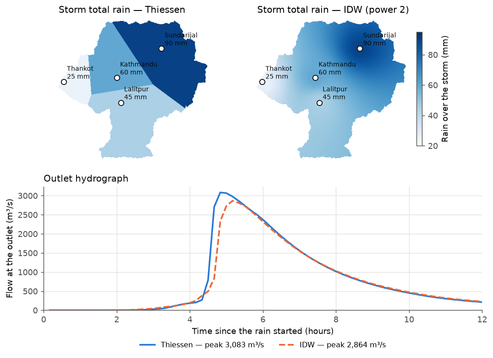

# 6 Rain gauges

**Goal:** drive the model with rain-gauge records, and compare the two ways of
spreading gauge rain over the basin: Thiessen and IDW.

**You need:** two CSV files. This example uses four made-up gauges in the
Kathmandu valley with a storm moving from the north-east hills (90 mm at
Sundarijal) to the west (25 mm at Thankot), over 6 hours in 30-minute steps.
Download them: [gauges.csv](../assets/data/gauges.csv),
[rain.csv](../assets/data/rain.csv).

```text
gauges.csv                                rain.csv (mm in each 30 minutes, first rows)
gauge_id,name,easting_m,northing_m        time_s,G01,G02,G03,G04
G01,Sundarijal,344296,3071617             0,0.0,0.0,0.0,0.0
G02,Kathmandu,334349,3065100              1800,12.1,1.6,0.4,0.1
G03,Lalitpur,335261,3059546               3600,17.7,3.9,1.2,0.2
G04,Thankot,322499,3064159                5400,20.0,7.3,2.9,0.7
```

The gauge coordinates are in the model projection (UTM 45N here), in metres.

**Settings used:** [[PRECIP_METHOD]], [[PRECIP_GAUGE_FILE]],
[[PRECIP_TIMESERIES_FILE]], [[PRECIP_IDW_POWER]].

## Set it up

=== "Notebook form"

    **3 Precipitation** → *Rain gauges — your own CSV records*. Underneath:
    *Spread the rain between points by* **Thiessen** or **IDW**; *Gauge locations
    (CSV)* `gauges.csv`; *Gauge rainfall (CSV)* `rain.csv`. With IDW, *More
    options* holds the *Distance-weighting power*.

=== "Config file + CLI"

    ```yaml
    DEM_PATH: dem.tif
    OUTPUT_POINT: [27.632222, 85.293333]
    TARGET_CRS_EPSG: EPSG:32645
    OUTPUT_DIR: results/gauges_thiessen/
    PRECIP_METHOD: thiessen          # or idw
    PRECIP_GAUGE_FILE: gauges.csv
    PRECIP_TIMESERIES_FILE: rain.csv
    RUNOFF_SOURCE: none
    TOTAL_SIMULATION_TIME_HOURS: 12.0
    ```

    ```bash
    MRRpy run -c gauges.yaml
    ```

=== "Python"

    ```python
    from MRRpy import Config, run_pipeline

    for method in ("thiessen", "idw"):
        cfg = Config(DEM_PATH="dem.tif", OUTPUT_POINT=(27.632222, 85.293333),
                     TARGET_CRS_EPSG="EPSG:32645", OUTPUT_DIR=f"results/gauges_{method}/",
                     PRECIP_METHOD=method,
                     PRECIP_GAUGE_FILE="gauges.csv", PRECIP_TIMESERIES_FILE="rain.csv",
                     RUNOFF_SOURCE="none", TOTAL_SIMULATION_TIME_HOURS=12.0)
        run_pipeline(cfg)
    ```

=== "QGIS plugin"

    Tab **2 · Precipitation** → *Method* **Thiessen polygons (gauge CSV)** or
    **Inverse Distance Weighting — IDW (gauge CSV)**. *Gauge metadata CSV*
    `gauges.csv`, *Timeseries CSV* `rain.csv` (and *IDW power* for IDW).
    *Exclude gauge/pixel centroids that fall outside the watershed* drops gauges
    outside the basin.

## Results



| Method | Basin-average rain | Peak (m³/s) | Peak at (h) |
|---|---|---|---|
| Thiessen | 63.0 mm | 3,083 | 4.8 |
| IDW (power 2) | 60.5 mm | 2,864 | 5.2 |

What to notice:

- **Thiessen** gives each part of the basin the rain of its nearest gauge. The
  whole north-east zone gets Sundarijal's 90 mm, with sharp steps between
  zones.
- **IDW** blends the gauges smoothly. The wettest gauge's influence fades with
  distance, so the basin average is a little lower and the peak a little later
  here.
- With few gauges, the choice matters most for **storm totals near the
  gauges with the most extreme rain**. With dense gauges the two converge.
- The gauge zones also become the **rainfall zones** of the saturation-excess
  process, so each zone can have its own soil store
  ([`VSA_PER_POLYGON`](../manual/runoff.md#VSA_PER_POLYGON)).

## Other options to try

| Change | Setting | See |
|---|---|---|
| a smoother or sharper IDW | `PRECIP_IDW_POWER: 1` or `3` | [3.3](../manual/precipitation.md#33-rain-gauges) |
| ignore gauges outside the basin | `PRECIP_EXCLUDE_OUTSIDE_STATIONS: true` | [3.3](../manual/precipitation.md#33-rain-gauges) |
| satellite rain instead | `PRECIP_METHOD: imerg_thiessen` | [Example 7](satellite-storm.md) |
| losses | `RUNOFF_SOURCE: physical` | [Example 5](physical-runoff.md) |
