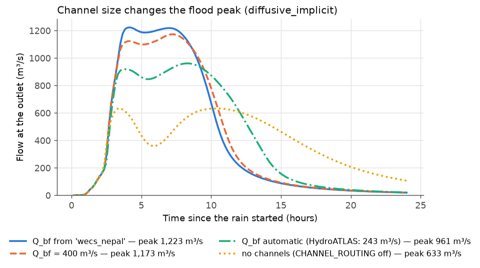

# 9 Roughness and river channels

**Goal:** set the two things that most control how fast a flood travels: the
**roughness** of the ground and rivers, and the **size of the river
channels**.

**Settings used:** [[MANNINGS_N_SOURCE]], [[MANNINGS_N_RASTER_PATH]],
[[MANNINGS_N_CHANNEL]], [[CHANNEL_ROUTING]], [[CHANNEL_GEOMETRY]],
[[CHANNEL_QBF_M3S]].

## Part A: channel size from the 2-year flood

The basin and storm are those of [Example 1](first-run.md), routed with
`diffusive_implicit` for 24 hours. Four runs differ only in the river channels:

| Run | Settings | Bankfull flow at the outlet |
|---|---|---|
| no channels | `CHANNEL_ROUTING: false` | — |
| automatic | `CHANNEL_QBF_M3S: null` (the default) | 243 m³/s, from HydroATLAS |
| a measured 2-year flood | `CHANNEL_QBF_M3S: 400` | 400 m³/s |
| a regional formula | `CHANNEL_QBF_M3S: wecs_nepal` | about 520 m³/s |

### Set it up

=== "Notebook form"

    Step **5 Routing** → *River channels*: *Give rivers a real channel* is ticked
    by default. *Channel size from* `discharge`; *Bankfull flow*: **Automatic**,
    **My 2-year flood at the outlet or a gauge** (`400`), or **A formula or
    regional preset** (`wecs_nepal`). The log of the run prints the estimate and
    the range it is likely in.

=== "Config file + CLI"

    ```yaml
    DEM_PATH: dem.tif
    OUTPUT_POINT: [27.632222, 85.293333]
    TARGET_CRS_EPSG: EPSG:32645
    OUTPUT_DIR: results/qbf_400/
    ROUTING_SCHEME: diffusive_implicit
    TOTAL_SIMULATION_TIME_HOURS: 24.0
    CHANNEL_ROUTING: true
    CHANNEL_GEOMETRY: discharge
    CHANNEL_QBF_M3S: 400.0          # or: null (automatic), wecs_nepal, "1.73 * A ^ 0.606"
    ```

    If your 2-year flood comes from a gauge upstream of the outlet, add its
    drainage area: `CHANNEL_QBF_AREA_KM2: 585`.

=== "Python"

    ```python
    from MRRpy import Config, run_pipeline

    variants = {"no_channels": dict(CHANNEL_ROUTING=False),
                "auto": dict(CHANNEL_QBF_M3S=None),
                "qbf_400": dict(CHANNEL_QBF_M3S=400.0),
                "wecs_nepal": dict(CHANNEL_QBF_M3S="wecs_nepal")}
    for name, settings in variants.items():
        cfg = Config(DEM_PATH="dem.tif", OUTPUT_POINT=(27.632222, 85.293333),
                     TARGET_CRS_EPSG="EPSG:32645", OUTPUT_DIR=f"results/{name}/",
                     ROUTING_SCHEME="diffusive_implicit",
                     TOTAL_SIMULATION_TIME_HOURS=24.0, **settings)
        run_pipeline(cfg)

    from MRRpy.core.routing.qbf import describe_presets
    print(describe_presets())        # the formula presets
    ```

=== "QGIS plugin"

    Tab **4 · Routing** → *Confined Channel Routing*: *Channel geometry* **From
    bankfull flow (default)**; *Bankfull flow (Q_bf)*: **Automatic — global
    estimate (HydroATLAS)**, **My 2-year flood at a gauge (number)** with
    *2-year flood* 400, or **Formula or regional preset** with *Formula*
    `wecs_nepal`.

### Results



| Run | Peak (m³/s) | Peak at (h) | Still in the basin after 24 h |
|---|---|---|---|
| no channels | 633 | 10.3 | 3.4 million m³ |
| automatic (243 m³/s) | 961 | 8.3 | 1.0 million m³ |
| 400 m³/s | 1,173 | 7.2 | 1.0 million m³ |
| `wecs_nepal` (~520 m³/s) | 1,223 | 4.2 | 1.0 million m³ |

What to notice:

- **Without channels**, river water spreads over whole 90 m cells, a few
  centimetres deep, and moves slowly: the lowest, latest flood, and the most
  water still in the basin after a day.
- **Bigger channels carry the flood faster** and higher. Between the automatic
  estimate and the regional formula the peak changes by 27 %, more than the
  difference between many runoff settings.
- The automatic estimate needs no data, but for 80 % of basins it lies within
  about 0.4–2.6 times the true 2-year flood. **If you know the 2-year flood,
  give it**: the median of 10 or more yearly peaks at a gauge.

## Part B: roughness that changes with elevation

There is no roughness source "by elevation" for the whole grid. Instead,
`mannings_n_from_dem` turns a DEM and an elevation rule into a roughness raster,
and `MANNINGS_N_SOURCE: raster` uses it. Here, the higher, rockier and more
forested land gets rougher. This basin is a small tributary downloaded as in
[Example 2](download-dem.md).

```python
from MRRpy import Config, run_pipeline, mannings_n_from_dem, plot_raster, plot_hydrograph

cfg = Config(
    DEM_BOUNDS_WGS84=(85.3809, 27.7625, 85.4773, 27.8223), DEM_SOURCE="nasadem",
    GEE_PROJECT="ee-yourname", OUTPUT_POINT=(27.77772, 85.42399),
    TARGET_CRS_EPSG="EPSG:32645", OUTPUT_DIR="results/elev_n/",
)
out = run_pipeline(cfg, stages=("process_dem",))

n_path = mannings_n_from_dem(
    dem_path=out["clipped_dem"],
    rule=[(1700, 0.035), (2000, 0.06), (2300, 0.10), (float("inf"), 0.14)],
    output_path="results/elev_n/mannings_n_elev.tif",
)
plot_raster(n_path, cmap="YlOrBr", label="Manning's n")

cfg.MANNINGS_N_SOURCE = "raster"
cfg.MANNINGS_N_RASTER_PATH = n_path
cfg.RAIN_INTENSITY_MM_HR = 20.0
cfg.RAIN_DURATION_HOURS = 1.0
cfg.TOTAL_SIMULATION_TIME_HOURS = 5.0
out.update(run_pipeline(cfg, stages=("routing",)))
plot_hydrograph(out)
```


`rule` is a list of ascending `(upper elevation, n)` pairs (as above), a
`{(min, max): n}` dictionary of elevation bands, or any function
`f(elevation_array) -> n_array`. The router's log confirms the map arrived:
`Manning's n | source=raster range=[0.035, 0.140]`. The raster also works in a
config file, the notebook form and QGIS: point `MANNINGS_N_RASTER_PATH` at it.

## Part C: river roughness on its own

`MANNINGS_N_CHANNEL` sets the roughness of river cells independently of the
ground. For example, land-cover roughness on the hillslopes and rougher
channels high up:

```yaml
MANNINGS_N_SOURCE: lulc                 # ground: ESA WorldCover (Earth Engine)
MANNINGS_N_CHANNEL: [[1700, 0.03], [2000, 0.05], [9000, 0.08]]
```

Other forms:

```yaml
MANNINGS_N_CHANNEL: 0.035                               # one value for all rivers
MANNINGS_N_CHANNEL: {1: 0.10, 2: 0.06, 3: 0.045, 4: 0.035}   # by stream order
MANNINGS_N_CHANNEL: channel_n.tif                       # a raster, read on river cells
MANNINGS_N_CHANNEL: null                                # rivers keep the ground roughness
```

In the notebook form these are the choices under *Manning's n in river
channels*; in QGIS, tick *Override roughness on channel cells* for one value.
The log says which form was used, e.g.
`Manning's n | channel cells: 1,620 / 74,795 (threshold=1234.6, mode=uniform)`.

## Other options to try

| Change | Setting | See |
|---|---|---|
| roughness from land cover | `MANNINGS_N_SOURCE: lulc` or `lcz` | [5.4.1](../manual/roughness.md#541-roughness-of-the-ground) |
| your own land-cover table | `LULC_LOOKUP_CSV: my_table.csv` | [5.4.3](../manual/roughness.md#543-land-cover-tables) |
| channels from drainage area | `CHANNEL_GEOMETRY: area`, `CHANNEL_HG: bieger_usa` | [5.5.3](../manual/channels.md#553-channel-size) |
| fewer, larger rivers | `CHANNEL_MIN_AREA_KM2: 50` | [5.5.1](../manual/channels.md#551-which-cells-are-rivers) |
| rivers that start with baseflow | `BASEFLOW_SPECIFIC_Q: 0.01` | [5.5.4](../manual/channels.md#554-baseflow) |
