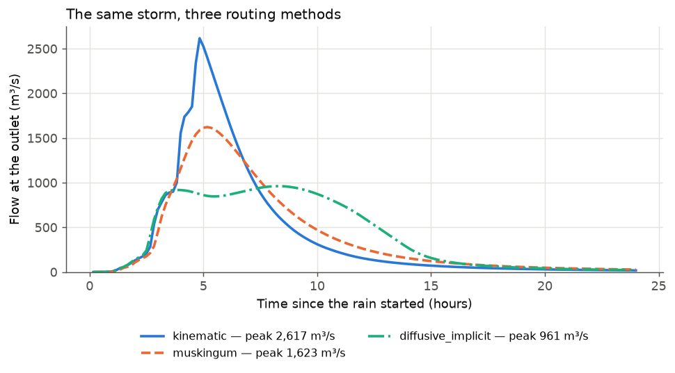

# 3 Compare routing methods

**Goal:** route the same runoff with three routing methods and see how the flood
changes. The storm and basin are those of [Example 1](first-run.md) (20 mm/h for
3 hours, all rain runs off), simulated for 24 hours. Only one setting changes:

**Settings used:** [[ROUTING_SCHEME]] = `kinematic`, `muskingum`,
`diffusive_implicit`. Everything else keeps its default, including river
channels sized from the [automatic bankfull flow](../manual/channels.md#553-channel-size).

The other two methods are left out: the explicit `diffusive` is deprecated (the
implicit one replaces it) and `dynamic` is still under development.

## Set it up

=== "Notebook form"

    Step **5 Routing** → *Routing method*: pick one. Its own settings open
    underneath (for `diffusive_implicit`, the solver settings are under *More
    options*; the defaults are fine). Use a separate results folder for each
    method.

=== "Config file + CLI"

    Make three copies of the `run.yaml` of Example 1 that differ in two lines:

    ```yaml
    ROUTING_SCHEME: diffusive_implicit     # or kinematic, muskingum (or the codes 0, 2, 4)
    OUTPUT_DIR: results/scheme_diffusive_implicit/
    TOTAL_SIMULATION_TIME_HOURS: 24.0
    ```

    ```bash
    for s in kinematic muskingum diffusive_implicit; do
        MRRpy run -c "run_$s.yaml"
    done
    ```

=== "Python"

    ```python
    from MRRpy import Config, run_pipeline, plot_hydrograph
    import matplotlib.pyplot as plt

    fig, ax = plt.subplots()
    for scheme in ("kinematic", "muskingum", "diffusive_implicit"):
        cfg = Config(DEM_PATH="dem.tif", OUTPUT_POINT=(27.632222, 85.293333),
                     TARGET_CRS_EPSG="EPSG:32645",
                     OUTPUT_DIR=f"results/scheme_{scheme}/",
                     RAIN_INTENSITY_MM_HR=20.0, RAIN_DURATION_HOURS=3.0,
                     TOTAL_SIMULATION_TIME_HOURS=24.0,
                     ROUTING_SCHEME=scheme)
        out = run_pipeline(cfg)
        plot_hydrograph(out, ax=ax, label=scheme)
    ax.legend()
    ```

=== "QGIS plugin"

    Tab **4 · Routing** → *Routing Scheme* → *Scheme*: pick one. For
    `diffusive_implicit`, the *Implicit solver* group appears (keep its
    defaults); it always runs on the CPU. Use a separate *Output directory* on
    tab 1 for each method.

## Results



| Method | Peak (m³/s) | Peak at (h) | Still in the basin after 24 h | Run time |
|---|---|---|---|---|
| `kinematic` | 2,617 | 4.8 | 0.9 million m³ | 33 s |
| `muskingum` | 1,623 | 5.2 | 2.0 million m³ | 155 s |
| `diffusive_implicit` | 961 | 8.3 | 1.0 million m³ | 29 s |

All three get the same 36.4 million m³ of runoff and conserve it: the
water-balance error is below 10⁻¹⁴ in each run. They differ in **when** the water
arrives.

What to notice:

- **Kinematic** moves each cell's water downhill at the speed Manning's equation
  gives for the ground slope. The flood stays sharp and arrives first.
- **Muskingum–Cunge** spreads the flood as a real flood wave does, so the peak is
  lower and a little later. How much it spreads doesn't depend on the cell size.
- **Implicit diffusive** uses the water-surface slope. Water on the flat floor of
  the Kathmandu valley is held back by the water downstream (backwater), the
  channels fill and spill onto their cells, and the outlet sees a long, flat
  flood instead of a spike.

Which is right? Only observations can tell. With a gauged hydrograph, compare
the timing and shape of the peak (the volume is the same for all three).

## Other options to try

| Change | Setting | See |
|---|---|---|
| smaller channels: more spreading | `CHANNEL_QBF_M3S: 100` | [Example 9](roughness-channels.md) |
| rougher ground: a slower flood | `MANNINGS_N: 0.15` | [5.4.1](../manual/roughness.md#541-roughness-of-the-ground) |
| a more accurate implicit run | `IMPLICIT_CFL_TARGET: 1.0` | [5.2](../manual/routing.md#52-simulation-time-and-time-step) |
| the GPU (explicit methods) | `BACKEND: gpu` | [6.3](../manual/outputs.md#63-computer-cpu-or-gpu) |
| many combinations at once | a Python loop | [Example 11](batch-runs.md) |
