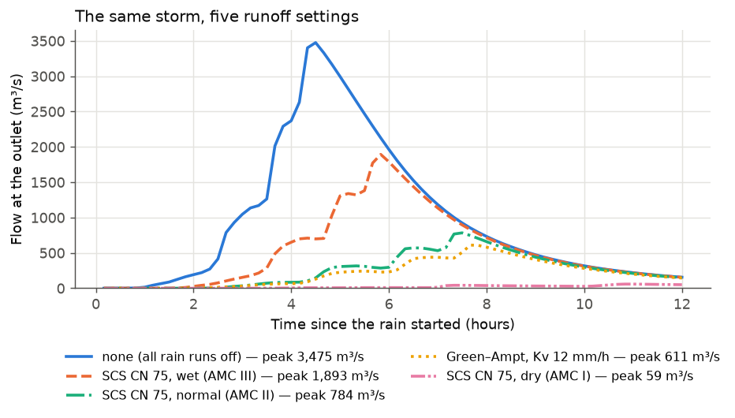

# 4 Runoff methods

**Goal:** see how much the runoff method matters. The same 75 mm storm (25 mm/h
for 3 hours) falls on the basin of [Example 1](first-run.md) five times:

| Run | Settings |
|---|---|
| none | `RUNOFF_SOURCE: none`: all rain runs off |
| SCS dry | `RUNOFF_SOURCE: scs_cn`, `RUNOFF_CN_SOURCE: scalar`, `RUNOFF_CN: 75`, `RUNOFF_CN_AMC: i` |
| SCS normal | the same with `RUNOFF_CN_AMC: ii` |
| SCS wet | the same with `RUNOFF_CN_AMC: iii` |
| Green–Ampt | `RUNOFF_SOURCE: physical`, `RUNOFF_MECHANISMS: [infiltration_excess]`, `GA_KSAT_MMHR: 12`, `GA_SUCTION_M: 0.15` |

Routing is kinematic in all five, for 12 hours.

**Settings used:** [[RUNOFF_SOURCE]], [[RUNOFF_CN_SOURCE]], [[RUNOFF_CN]],
[[RUNOFF_CN_AMC]], [[RUNOFF_MECHANISMS]], [[GA_KSAT_MMHR]], [[GA_SUCTION_M]].

## Set it up

=== "Notebook form"

    Start from the form of Example 1, with rain intensity `25`.

    - **4 Runoff** → `scs_cn`. Underneath: *Curve numbers from* `scalar`, *Curve
      number* `75`, *Soil wetness before the storm* `i`, `ii` or `iii`.
    - For Green–Ampt: **4 Runoff** → `physical`, tick only *infiltration_excess*.
      Its settings open under the tick box: *Soil infiltration rate* `12`, *Soil
      suction head* `0.15`.

    Change the results folder for each run, so the runs don't overwrite each
    other.

=== "Config file + CLI"

    The SCS run with normal wetness; add these lines to the `run.yaml` of
    Example 1:

    ```yaml
    RAIN_INTENSITY_MM_HR: 25.0
    RUNOFF_SOURCE: scs_cn
    RUNOFF_CN_SOURCE: scalar
    RUNOFF_CN: 75.0
    RUNOFF_CN_AMC: ii
    OUTPUT_DIR: results/scs_amc_ii/
    ```

    The Green–Ampt run instead:

    ```yaml
    RAIN_INTENSITY_MM_HR: 25.0
    RUNOFF_SOURCE: physical
    RUNOFF_MECHANISMS: [infiltration_excess]
    GA_KSAT_MMHR: 12.0
    GA_SUCTION_M: 0.15
    OUTPUT_DIR: results/green_ampt/
    ```

    ```bash
    MRRpy run -c scs_amc_ii.yaml
    ```

=== "Python"

    ```python
    from MRRpy import Config, run_pipeline

    base = dict(DEM_PATH="dem.tif", OUTPUT_POINT=(27.632222, 85.293333),
                TARGET_CRS_EPSG="EPSG:32645", RAIN_INTENSITY_MM_HR=25.0,
                RAIN_DURATION_HOURS=3.0, TOTAL_SIMULATION_TIME_HOURS=12.0)

    runs = {
        "none": dict(RUNOFF_SOURCE="none"),
        "green_ampt": dict(RUNOFF_SOURCE="physical",
                           RUNOFF_MECHANISMS=["infiltration_excess"],
                           GA_KSAT_MMHR=12.0, GA_SUCTION_M=0.15),
    }
    for amc in ("i", "ii", "iii"):
        runs[f"scs_amc_{amc}"] = dict(RUNOFF_SOURCE="scs_cn", RUNOFF_CN_SOURCE="scalar",
                                      RUNOFF_CN=75.0, RUNOFF_CN_AMC=amc)

    for name, settings in runs.items():
        cfg = Config(OUTPUT_DIR=f"results/{name}/", **base, **settings)
        run_pipeline(cfg)
    ```

=== "QGIS plugin"

    Tab **3 · Runoff**:

    - *Mode* **SCS Curve Number**; *CN source* `scalar`, *AMC* I, II or III,
      *Curve number* 75.
    - Or *Mode* **Physical — composable mechanisms**; tick only
      *Infiltration-excess (Green-Ampt / Horton)*; *Vertical Ksat* 12 mm/h,
      *Suction ψ* 0.15 m.

    Use a different *Output directory* on tab 1 for each run.

## Results



| Run | Curve number used | Runoff ÷ rain | Peak (m³/s) | Peak at (h) |
|---|---|---|---|---|
| none | — | 1.00 | 3,475 | 4.5 |
| SCS wet (AMC III) | 88 | 0.59 | 1,894 | 5.8 |
| SCS normal (AMC II) | 75 | 0.31 | 784 | 7.5 |
| Green–Ampt, 12 mm/h | — | 0.27 | 611 | 7.7 |
| SCS dry (AMC I) | 57 | 0.08 | 59 | 11.0 |

The share of rain that ran off comes from `runoff_ratio` in each run's
`mass_balance.csv`. The SCS numbers can be checked by hand with the
[SCS equations](../manual/runoff.md#45-scs-curve-number): for CN 75,
$S = 84.7$ mm and $I_a = 16.9$ mm, so 75 mm of rain gives
$Q = (75 - 16.9)^2/(75 - 16.9 + 84.7) = 23.6$ mm, 31 % of the rain.

What to notice:

- **The runoff method changes the flood more than anything else** here: from
  59 to 3,475 m³/s for the same storm. Choose it, and the soil wetness, with
  care.
- **Losses delay the peak.** The early rain fills the initial abstraction or
  soaks in, so runoff starts later.
- **Green–Ampt** sheds rain only while it falls faster than the soil can take it:
  25 mm/h against a capacity that drops towards 12 mm/h as the soil wets.

## With global curve numbers (GCN250)

With `RUNOFF_CN_SOURCE: gee`, each cell gets its own curve number from the
GCN250 map, which has separate dry, average and wet versions. On a 106 km²
Himalayan basin under a 120 mm storm, an earlier run gave:

| GCN250 map | Mean CN | Peak | Runoff volume |
|---|---|---|---|
| Dry (AMC I) | 55 | 113 m³/s | 1.4 million m³ |
| Average (AMC II) | 74 | 317 m³/s | 4.1 million m³ |
| Wet (AMC III) | 87 | 447 m³/s | 7.1 million m³ |

Each map is downloaded once and saved as `cn_gcn250_amc<i|ii|iii>.tif` in the
results folder.

## Other options to try

| Change | Setting | See |
|---|---|---|
| global curve numbers (GCN250) | `RUNOFF_CN_SOURCE: gee` (needs Earth Engine) | [4.5](../manual/runoff.md#45-scs-curve-number) |
| your own curve-number map | `RUNOFF_CN_SOURCE: raster`, `RUNOFF_CN_PATH: cn.tif` | [4.5](../manual/runoff.md#45-scs-curve-number) |
| urban initial abstraction | `RUNOFF_SCS_Ia_FACTOR: 0.05` | [4.5](../manual/runoff.md#45-scs-curve-number) |
| a fixed fraction per cell | `RUNOFF_SOURCE: coefficient`, `RUNOFF_COEFFICIENT_PATH: cf.tif` | [4.3](../manual/runoff.md#43-runoff-coefficient) |
| Ksat from a global soil map | `GA_KSAT_SOURCE: gee` | [4.6.2](../manual/runoff.md#462-infiltration-excess-greenampt) |
| saturation excess too | [Example 5](physical-runoff.md) | |
