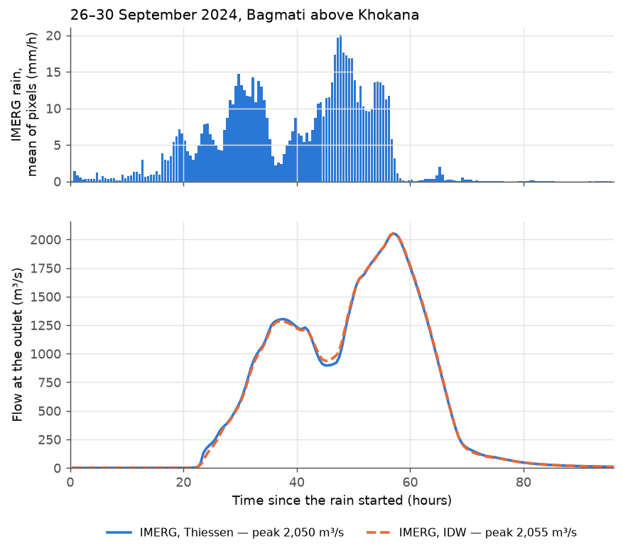

# 7 A real storm from satellite

**Goal:** model a real flood anywhere on Earth, with no rain gauges, using NASA's
IMERG satellite rainfall. The storm here is the record **26–28 September 2024**
rain that flooded Kathmandu.

**You need:** an Earth Engine sign-in and project
([setup](../manual/earth-engine.md)) and `pip install "MRRpy[gee]"`.

**Settings used:** [[PRECIP_METHOD]], [[EVENT_START_UTC]],
[[TOTAL_SIMULATION_TIME_HOURS]], [[GEE_PROJECT]], [[RUNOFF_SOURCE]],
[[RUNOFF_CN_SOURCE]], [[ROUTING_SCHEME]].

MRRpy downloads the 30-minute IMERG rain over the basin, from the storm start
for the simulation length (here 96 hours from 00:00 UTC on 26 September), and
uses each 11 km pixel as a rain gauge. Runoff is SCS Curve Number; routing is
the implicit diffusive wave.

## Set it up

=== "Notebook form"

    1. **3 Precipitation** → *Satellite — NASA IMERG (Google Earth Engine)*, then
       **Thiessen** (or **IDW**). Underneath: *Storm start (UTC)*
       `2024-09-26 00:00`. An *Earth Engine* box appears: your project ID, then
       **Connect to Earth Engine**.
    2. **4 Runoff** → `scs_cn`, *Curve numbers from* `gee` (GCN250),
       *Soil wetness before the storm* `ii`.
    3. **5 Routing** → `diffusive_implicit`, simulation length `96`.

=== "Config file + CLI"

    ```yaml
    DEM_PATH: dem.tif
    OUTPUT_POINT: [27.632222, 85.293333]
    TARGET_CRS_EPSG: EPSG:32645
    OUTPUT_DIR: results/sept2024/
    GEE_PROJECT: ee-yourname
    PRECIP_METHOD: imerg_thiessen
    EVENT_START_UTC: '2024-09-26 00:00'
    TOTAL_SIMULATION_TIME_HOURS: 96.0
    OUTPUT_INTERVAL_SECONDS: 1800
    RUNOFF_SOURCE: scs_cn
    RUNOFF_CN_SOURCE: gee
    RUNOFF_CN_AMC: ii
    ROUTING_SCHEME: diffusive_implicit
    ```

    ```bash
    MRRpy validate -c sept2024.yaml     # reports a missing Earth Engine project before running
    MRRpy run -c sept2024.yaml
    ```

=== "Python"

    ```python
    from MRRpy import Config, run_pipeline, plot_hydrograph

    cfg = Config(
        DEM_PATH="dem.tif", OUTPUT_POINT=(27.632222, 85.293333),
        TARGET_CRS_EPSG="EPSG:32645", OUTPUT_DIR="results/sept2024/",
        GEE_PROJECT="ee-yourname",
        PRECIP_METHOD="imerg_thiessen", EVENT_START_UTC="2024-09-26 00:00",
        TOTAL_SIMULATION_TIME_HOURS=96.0, OUTPUT_INTERVAL_SECONDS=1800,
        RUNOFF_SOURCE="scs_cn", RUNOFF_CN_SOURCE="gee", RUNOFF_CN_AMC="ii",
        ROUTING_SCHEME="diffusive_implicit",
    )
    out = run_pipeline(cfg)
    plot_hydrograph(out)
    ```

=== "QGIS plugin"

    1. Tab **2 · Precipitation** → *Method* **IMERG V07 satellite — Thiessen
       (Earth Engine)**. In the *Earth Engine* group: *GEE project*, tick *Set an
       event start date (UTC)* and enter 2024-09-26 00:00.
    2. Tab **3 · Runoff** → **SCS Curve Number**, *CN source* `gee`, *AMC* II.
    3. Tab **4 · Routing** → `diffusive_implicit`, *Simulation duration* 96 h.

    In the QGIS Python console, sign in once with `import ee; ee.Authenticate()`.

## Results



- IMERG puts about **390 mm** on the basin in 96 hours, in two bursts: on 27
  September, and from late on 27 September into 28 September.
- GCN250 gives the basin curve numbers between 70 and 91 (about 76 on average,
  normal wetness). **81 %** of the rain ran off: on a storm this long and wet,
  the SCS losses are small compared with the rain.
- The outlet peaks at about **2,050 m³/s, 57 hours** after the start (09:00 UTC
  on 28 September). Thiessen and IDW give almost the same hydrograph here: the
  basin spans only a few IMERG pixels.
- Each run took under 2 minutes on one CPU.

The rain is saved in `results/sept2024/imerg/` as `gauges.csv` and
`timeseries.csv`, in the same format as [your own gauges](rain-gauges.md), so
you can open, check or edit it. The curve numbers are saved as
`cn_gcn250_amcii.tif`. Later runs reuse both.

!!! note "Compare with observations"
    Satellite rain smooths intense local bursts, and curve numbers are a rough
    model of losses. Treat a run like this as a first estimate. Where an
    observed hydrograph exists, compare the runoff volume first, then the peak.

## Other options to try

| Change | Setting | See |
|---|---|---|
| distance-weighted pixels | `PRECIP_METHOD: imerg_idw` | [3.4](../manual/precipitation.md#34-satellite-rain-nasa-imerg) |
| soil wetness from satellite for the storm date | `RUNOFF_SOURCE: physical`, `VSA_SD_SOURCE: gee` | [4.6.5](../manual/runoff.md#465-soil-from-satellite-data) |
| land-cover roughness | `MANNINGS_N_SOURCE: lulc` | [5.4.1](../manual/roughness.md#541-roughness-of-the-ground) |
| a wet start | `RUNOFF_CN_AMC: iii` | [4.5](../manual/runoff.md#45-scs-curve-number) |
| fetch the rain again | `PRECIP_IMERG_FORCE_DOWNLOAD: true` | [3.4](../manual/precipitation.md#34-satellite-rain-nasa-imerg) |
| a large Himalayan basin | [Case study: Nepal (Trishuli)](nepal-case-study.md) | |
