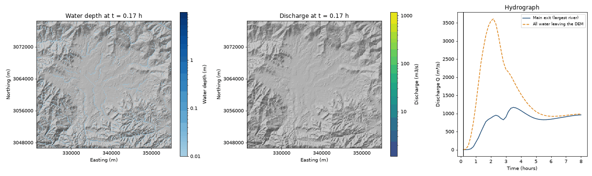
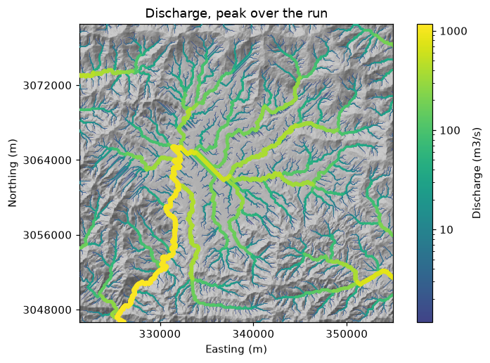

# 10 The whole DEM and flood maps

**Goal:** see how water spreads over a whole area, a city or a valley with
several rivers, rather than one watershed. Then make flood maps and an
animation.

**Settings used:** [[MODEL_AREA]], [[SAVE_FIELDS]], [[FIELD_VARS]],
[[OUTPUT_INTERVAL_SECONDS]].

With `MODEL_AREA: whole_dem`, MRRpy skips the outlet and the delineation and
routes **every cell of the DEM**. Water leaves wherever it flows off the edge or
into a no-data hole, so make the DEM cover the uphill land that drains into your
area. `SAVE_FIELDS` records maps of depth, velocity and discharge at every output
time.

## Set it up

=== "Notebook form"

    1. **Terrain** → *Area to model*: *whole_dem*. No outlet is asked.
    2. **Precipitation**: design storm `30` mm/h for `2` hours.
    3. **Routing**: simulation length `8`; *Save results every* `600`.
    4. **Outputs and run**: tick *Save maps over time*, then run. The notebook's
       last cells draw the maps (see `notebooks/configure_and_run.ipynb`).

=== "Config file + CLI"

    ```yaml
    DEM_PATH: dem_90m.tif
    MODEL_AREA: whole_dem
    TARGET_CRS_EPSG: EPSG:32645
    OUTPUT_DIR: results/whole/
    RAIN_INTENSITY_MM_HR: 30.0
    RAIN_DURATION_HOURS: 2.0
    ROUTING_SCHEME: diffusive_implicit
    TOTAL_SIMULATION_TIME_HOURS: 8.0
    OUTPUT_INTERVAL_SECONDS: 600
    SAVE_FIELDS: true
    ```

    ```bash
    MRRpy run -c whole.yaml
    ```

    Then draw the maps in Python (next tab).

=== "Python"

    ```python
    from MRRpy import Config, run_pipeline, plot_field, animate_fields, export_peak_maps

    cfg = Config(
        DEM_PATH="dem_90m.tif",
        MODEL_AREA="whole_dem",              # no OUTPUT_POINT needed
        TARGET_CRS_EPSG="EPSG:32645",
        OUTPUT_DIR="results/whole/",
        RAIN_INTENSITY_MM_HR=30.0,
        RAIN_DURATION_HOURS=2.0,
        ROUTING_SCHEME="diffusive_implicit",
        TOTAL_SIMULATION_TIME_HOURS=8.0,
        OUTPUT_INTERVAL_SECONDS=600,         # one saved map every 10 minutes
        SAVE_FIELDS=True,
    )
    out = run_pipeline(cfg)

    plot_field(out, "depth")                       # the deepest water each cell reached
    plot_field(out, "discharge", time=2.5)         # the flow 2.5 h into the storm
    animate_fields(out, ["depth", "discharge"])    # results/whole/depth_discharge_animation.gif
    export_peak_maps(out)                          # max_depth.tif, … for QGIS
    ```

=== "QGIS plugin"

    1. Tab **1 · DEM & Watershed** → *Area to model*: **The whole DEM (no
       outlet)**, then **Use whole DEM**.
    2. Tab **4 · Routing**: tick *Save maps over time*.
    3. **Run**. On tab **5 · Results**, **Load Peak Maps** adds the peak depth and
       discharge maps to the project; **Save Flow Animation…** writes a GIF.

## Results



*A 30 mm/h, 2-hour storm over the whole 90 m Kathmandu-valley DEM
(`diffusive_implicit`), made with `animate_fields(out, ["depth", "discharge"])`.
Left: water depth; the valley floor ponds. Middle: discharge as river lines that
widen with the flow, draining off several edges of the DEM, the main river to
the south-west. Right: the flow at the main exit and all water leaving the DEM.*

{ width="560" }

*`plot_field(out, "discharge")`: the highest flow each river reached.*

What changes in a whole-DEM run:

- **`hydrograph.csv`**: `Q_m3s` is the flow at the *main exit*, where the largest
  river leaves the DEM (the log prints where). An extra column,
  `Q_total_outflow_m3s`, is all water leaving the DEM. For flow at other places,
  add [virtual gauges](../manual/outputs.md#61-virtual-gauges).
- **`watershed.tif` / `watershed.geojson`** keep their names but hold the whole
  modelled area, so Earth Engine downloads and the QGIS layers work as usual.
- The **automatic channel size** is estimated at the main exit instead of at an
  outlet point.

About the maps: `animate_fields` takes one quantity or a list. Discharge is drawn
as river lines along the flow network, wider and brighter with more water (pass
`lines=False` for plain cells); flows below 0.1 % of the run's peak are left out
so the rivers stand out (`min_value` changes that). Every frame uses the same
colour scale and shows its time. Pass `out_path="flow.mp4"` for a video (needs
ffmpeg) or `every=3` for a shorter GIF. `export_peak_maps` writes, for each saved
quantity, `max_<var>.tif` and `time_of_max_<var>_hours.tif` (when the peak came).

!!! tip "How far does the water spread?"
    The routing passes water from cell to cell along one flow path, so these
    depth maps show the rivers as a one-cell ribbon. For flood depth and extent
    beside the rivers, turn on `INUNDATION_MAP`
    ([Example 12](flood-maps.md)).

!!! note "Memory"
    The maps stay in memory until the run ends: about *saved times × cells ×
    quantities × 4 bytes*. The log prints the estimate and warns above 2 GB. For
    a large DEM, raise `OUTPUT_INTERVAL_SECONDS` or `FIELD_STRIDE`, or save only
    `FIELD_VARS: [depth]`.

## Other options to try

| Change | Setting | See |
|---|---|---|
| maps for a single watershed | `MODEL_AREA: watershed` with `SAVE_FIELDS: true` | [6.2](../manual/outputs.md#62-maps-over-time) |
| fewer maps, less memory | `FIELD_STRIDE: 3`, `FIELD_VARS: [depth]` | [6.2](../manual/outputs.md#62-maps-over-time) |
| flow at named places | `ROUTING_GAUGES` | [6.1](../manual/outputs.md#61-virtual-gauges) |
| a faster explicit run on the GPU | `ROUTING_SCHEME: kinematic`, `BACKEND: gpu` | [6.4](../manual/outputs.md#64-computer-cpu-or-gpu) |
