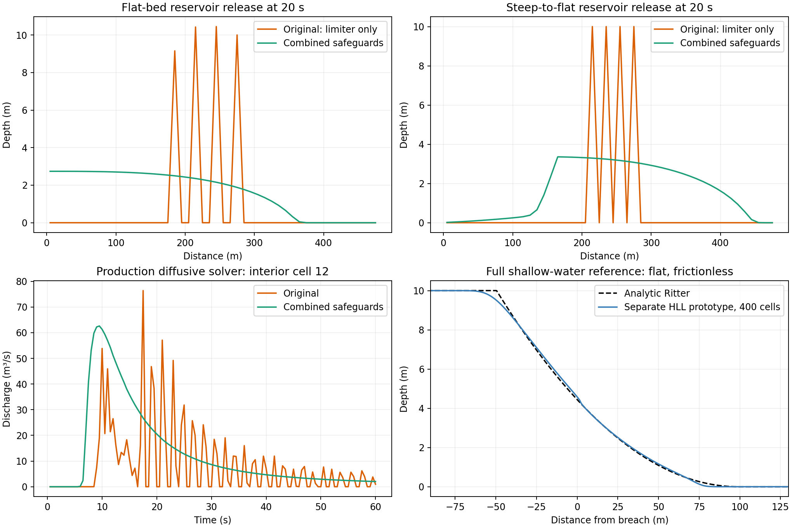

**Routing mathematics and dam-release stability audit — 19 September 2026**

Follow-up: [flat-water stiffness and independent solver experiments](diffusive-flat-water-investigation.md) adds nonlinear tree solves, unregularized flux-variable tests, and a stronger explicit bound below the regularization threshold. The measurements below predate that final bound adjustment.

The previous diffusive safeguards were insufficient. Donor-volume clipping closed the mass budget while allowing severe interior oscillations. The combined changes suppress those oscillations in the tests below, but they do not turn a downstream-only diffusion model into a valid general dam-break solver.

This audit covers the routing kernels, timestep controller, transfers, geometry, mass ledger and CPU/CUDA dispatch. It is not a validation of every rainfall/runoff equation or the user's particular DEM/event, which was not supplied. Tests use synthetic, reproducible scenarios rather than calibrated observations.



**The mathematical defect and the implemented remedy.**

Write a cell's stored volume as $V_i=\Omega_i h_i$, its cross-sectional area as $A_i=B_i h_i$, and rectangular hydraulic radius as $R_i=A_i/(B_i+2h_i)$. Manning conveyance is $K_i=A_iR_i^{2/3}/n_i$, so a downstream-only diffusion link has $Q_i=K_i\sqrt{\max(S_i,0)}$ and $S_i=(z_i-z_j+h_i-h_j)/L_i$.

At positive slope, $\partial Q/\partial S=Q/(2S)$. The linearized hydraulic diffusivity is $D=Q/(2BS)$; it increases as the water-surface slope approaches zero, even as discharge decreases. Therefore small velocity does not imply a large stable explicit timestep. For uniform storage and spacing, an upwind-advection/centered-diffusion Euler discretization requires $c\Delta t/\Delta x+2D\Delta t/\Delta x^2\leq1$. Pure diffusion has $D\Delta t/\Delta x^2\leq1/2$ for stability; avoiding sign alternation of its shortest Fourier mode is stricter, $\leq1/4$. These are linearized criteria, not a global nonlinear proof. This distinction and the sawtooth behavior at the diffusion stability limit are illustrated in Langtangen and Linge's textbook, [Finite Difference Computing with PDEs](https://hplgit.github.io/fdm-book/doc/pub/book/html/._decay-book009.html).

The old router explicitly removed the diffusion bound, applied only an advective CFL estimate, and increased an undersized computed timestep to `CFL_DT_MIN`. Its limiter $Q\Delta t\leq V$ ensured a donor did not become negative; it did not constrain exchange between nearly equal neighboring stages. Averaging the outlet hydrograph can hide the resulting oscillations.

The source changes implement these guards together:

1. **True interior stage gradients.** At `DIFFUSION_THETA=1`, the interior bed contribution comes from the DEM difference, without `MIN_SLOPE` or the rating-slope cap. A level lake now gives zero interior flux. `theta=0` retains the kinematic endpoint. Boundary links retain free normal outflow; closed or stage-controlled boundaries are not newly implemented.
2. **Finite low-slope conductance.** Interior diffusive links use $Q=K\phi(S)$, where $\phi(S)=\max(S,0)/\sqrt{\max(S,\epsilon)}$, default `DIFFUSION_SLOPE_EPS=1e-6`. Above epsilon it equals Manning; at zero head it gives zero flow with bounded one-sided derivative. This is a deliberate constitutive regularization, not an exact representation of unregularized diffusion at arbitrarily small slopes. Epsilon sensitivity must be checked.
3. **A graph-aware timestep.** Define the conservative conveyance derivative bound $a_i=(5/3)Q_i/h_{flow,i}$ and interior secant conductance $G_i=\theta K_i/[L_i\sqrt{\max(S_i,\epsilon)}]$. The implemented inverse-step bound is $\lambda_i=[a_i+G_i+\sum_{k\to i}(G_k+\theta a_k)]/\Omega_i$. The incoming terms include all tributaries and the receiver's actual storage footprint. They conservatively overestimate some conveyance derivatives. On a uniform positive-slope chain the secant conductance is twice the local slope derivative; this supplies additional protection against overshooting level water. The helper is a local safeguard, not a claimed nonlinear TVD theorem for arbitrary geometry or forcing.
4. **Respect the smaller step.** `dt <= CFL_TARGET/max(lambda)` is enforced; `CFL_DT_MIN` is a warning threshold, never a floor. Static `TIME_STEP_SECONDS` is now an upper bound and is subcycled if unsafe. Growth/output/end-time constraints can only shorten a safe step. This intentionally changes old static-run behavior and can substantially increase cost.
5. **Simultaneous conservative transfers.** Kinematic, diffusive and local-inertial routing subtract and receive the same face volume in the same step. The previous one-step delay artificially held water outside both cells and changed propagation. MC retains its historical rate recurrence and separate in-transit accounting.
6. **Positivity and diagnostics.** Dry cells have zero conveyance; donor limiting remains active. Disabling the limiter no longer silently clips negative cell storage to zero. Invalid numerical controls/geometry fail early; nonfinite rates/states raise. Diagnostics expose actual timestep extrema, limiter use, minimum storage, Froude estimates and invalid MC coefficients. Bed and depth differences are evaluated separately to reduce cancellation at high elevations. This cannot recover elevation precision already lost when a DEM was cast to float32.

The arithmetic above is our derivation for this implementation; it must be judged alongside the experiments, rather than treated as a textbook proof for this particular directed graph. The need for adaptive diffusion timesteps in raster storage models is also documented by [Hunter et al. (2005)](https://research-information.bris.ac.uk/en/publications/an-adaptive-time-step-solution-for-raster-based-storage-cell-mode).

**What was actually tested.**

The production sweep ran all four routing options over a steep-to-flat transition, flat bed, steep bed, tenfold width contraction, four-tributary confluence and diagonal links. Each case used float64 and float32: 48 original runs and 48 modified runs. A two-second pulse injected 1,000 m³ at a headwater, or 4,000 m³ across four tributaries, followed by drainage to 60 seconds. Interior depths/discharges, not just outlet averages, were inspected. The 32-cell synthetic network uses 10 m cells, Manning n=0.025 and up to 8% bed slope.

Separate reservoir-release tests start with 10 m depth over the first 80 m of a 480 m channel, width 10 m and n=0.025, with a dry downstream bed and closed ends. They directly exercise the production diffusion kernel/controller with both a flat bed and a 10% slope flattening at 160 m. A frozen, explicitly coded version of the old law/lag reproduces the old defect. These are diffusion-model stress tests, not physical dam-break validation against the shallow-water equations.

For the flat reservoir after 20 seconds:

| Applied candidate | Largest upward depth jump during run | Mean final depth difference from refined diffusion reference | Outcome |
|---|---:|---:|---|
| Original limiter, 0.5 s | 10.446 m | 2.130 m | Severe oscillation despite mass closure |
| Original law, 0.05 s | 3.045 m | 0.0521 m | Better, still oscillatory |
| Reduce theta to 0.2, 0.5 s | 10.446 m | 2.130 m | Fails in this case |
| Cap rating slope at 0.02, 0.5 s | 10.446 m | 2.130 m | Fails in this case |
| Synchronous transfers alone, 0.5 s | 18.705 m | 3.331 m | Fails without timestep control |
| True gradients + regularization alone, 0.5 s | 10.000 m | 3.281 m | Fails without timestep control |
| Combined guards | 0 m | 0.00000220 m | No clipping; no new depth reversal |

The final-column reference uses the same regularized equations with a smaller timestep ceiling. A successful comparison is temporal consistency, not proof of physical fidelity. On the steep-to-flat reservoir, the combined guard's mean final depth difference was 0.000974 m; physically varying depth over a varying bed need not be monotone, so upward depth jumps there are not alone an oscillation metric.

The production steep-to-flat diffusive case's normalized temporal-curvature diagnostic fell from 1.402 to 0.128. This is a ringing indicator, not a universal accuracy norm. The figure shows the actual interior hydrograph. Epsilon values `1e-4, 1e-5, 1e-6, 1e-7` were also applied: the largest final-depth difference in the tested flat reservoir was 0.0000388 m. This small sensitivity is specific to these experiments; it is not evidence that all low-gradient floodplains are insensitive.

Grid refinement at fixed physical domain and initial reservoir volume reduced mean depth error relative to the 96-cell result:

| Diffusion case, 5 seconds | 24 cells | 48 cells |
|---|---:|---:|
| Flat | 0.1088 m | 0.0428 m |
| Steep-to-flat | 0.1870 m | 0.0724 m |

Time refinement of the **production** steep-to-flat pulse, comparing all recorded depths with the 0.02 s ceiling run, gave:

| Scheme | 0.5 s ceiling mean difference | 0.1 s ceiling mean difference | Remaining limitation |
|---|---:|---:|---|
| Kinematic | 0.01652 m | 0.00385 m | No backwater or momentum dynamics |
| Diffusive | 0.00219 m | 0.00168 m | No acceleration; directed flow; regularized low slopes |
| Muskingum–Cunge | 0.20168 m | 0.00947 m | Negative storage remains even at 0.02 s |
| Local-inertial `dynamic` | 0.47075 m | 0.25239 m | Strong timestep sensitivity; not validated for this surge |

For adaptive runs a ceiling is not the actual step; the controller can reduce several ceilings to the same stable trajectory. The fine runs in this table are numerical comparisons, not exact solutions.

**Other routing mathematics and failure modes.**

Manning's rectangular celerity is $c=dQ/dA=(Q/A)[1+(2/3)B/(B+2h)]$. The familiar $5Q/(3A)$ is exact only for a wide sheet. It is a conservative timestep estimate for rectangles, but using it in MC's physical-diffusion matching changes the method. MC now uses the exact derivative and $D_g=Q_{ref}/(BS_0cL)$. A finite-difference derivative test and a randomized inverse-rating sweep verify the channel algebra; the 5,000-case normal-depth inversion check had worst relative discharge residual about $8.5\times10^{-12}$.

The MC homogeneous coefficients are $(Cr+D_g-1,\ Cr+1-D_g,\ 1+D_g-Cr)/(1+Cr+D_g)$. All are nonnegative only when $|1-D_g|\leq Cr\leq1+D_g$. Thus decreasing dt can make C0 or C1 negative; negative coefficients are not always a harmless small dip. This follows from the standard recurrence in the [HEC-HMS Muskingum–Cunge technical reference](https://www.hec.usace.army.mil/confluence/hmsdocs/hmstrm/channel-flow/muskingum-cunge-model). The current variable-parameter, lagged recurrence retains a signed ledger: the final sweep reached approximately **−147.6 m³ in a cell** despite closing the total budget. This is exposed with warnings and diagnostics; it is not fixed by changing the celerity alone. A physical conservative MC redesign/reach discretization is still required before treating these surge depths as valid. No claim is made that MC is now positivity preserving.

The local-inertial update retains local acceleration and semi-implicit Manning friction but omits advective momentum. Flux centering adds numerical diffusion; it does not make the method shock preserving. Centering discharges across a confluence or abrupt width change is also outside the simple uniform-grid derivation. In the tested pulses, 11–33% of wet cells were clipped in the worst step, with very large near-front Froude estimates. These estimates flag a regime problem; they are not validated physical velocities. The local-inertial approximation's restrictions are analyzed by [de Almeida and Bates (2013)](https://agupubs.onlinelibrary.wiley.com/doi/10.1002/wrcr.20366). Misleading claims that this option preserves the true dam-break shock have been removed.

All four options follow a fixed D8 network. Diffusive and local-inertial negative discharge is suppressed, so they cannot resolve arbitrary flow reversal, reservoir spreading, lateral floodplain exchange or hydraulic jumps. Boundary slope assumptions, unresolved forcing changes, source time integration, DEM/width errors and domain truncation remain accuracy concerns beyond the checks here. The current production router starts dry; reservoir initial conditions in this audit belong to the separate kernel experiments.

**Alternatives were implemented as experiments before recommending them.**

A separate CPU backward-Euler diffusion prototype uses damped Picard iterations and rejects unconverged nonlinear steps. On the flat reservoir it used 40 accepted steps at 0.5 s, 1,598 nonlinear iterations, no negative depths or new extrema, and mass error below $7\times10^{-11}$ m³. Differences from a refined explicit solution fell from 0.01407 to 0.00296 to 0.000602 m at timestep ceilings 0.5, 0.1 and 0.02 s. The guarded explicit 0.5 s ceiling run required 14,545 steps. Counts are not wall-time speedups. The implicit prototype is restricted to a flat closed 1-D channel, CPU only; it has not been integrated or validated on the production D8 graph or terrain.

A separate conservative full shallow-water HLL prototype was tested against the frictionless dry-bed Ritter solution. At 200, 400 and 800 cells, mean depth errors were 0.05954, 0.03780 and 0.02349 m; depth stayed nonnegative and mass closed to roundoff. The benchmark follows the shallow-water Riemann framework in [Ketcheson, LeVeque and del Razo's interactive textbook](https://www.clawpack.org/riemann_book/html/Shallow_water.html) and the [Clawpack solver documentation](https://www.clawpack.org/master/riemann/Shallow_water_Riemann_solvers.html). This prototype is flat-bed, frictionless and 1-D: bed-step balancing, wet/dry terrain, friction, variable widths, networks and GPU validation are still necessary for a production replacement.

For the user's fast dam-break application, a full-momentum solver is the recommended physical direction. USACE likewise recommends comparing full shallow-water and diffusion equations for rapidly rising breach waves because acceleration can materially change the result: [HEC-RAS dam-breach guidance](https://www.hec.usace.army.mil/confluence/rasdocs/hgt/latest/tutorials/2d-unsteady-flow/dam-breach-analysis-with-2d-areas). The experiments justify developing that path; they do not establish that the existing production options predict a real dam-break accurately. For slowly varying diffusion-dominated floods, the implemented explicit guards are usable candidates, while an implicit implementation is the tested direction for alleviating stiffness.

**Precision, hardware, and reproducibility.**

Final pytest result: **130 passed, 76 skipped**. Of the skips, 74 require real CUDA and two require external QGIS/demo rasters. These counts include the existing suite and new CPU numerical regressions, not GPU passes. This Mac is ARM64, has no CuPy/CUDA device, and the explicit GPU audit request failed with `CUDA GPU unavailable: refusing CPU fallback for GPU audit`. GPU behavior remains **unverified**. The CuPy availability probe was corrected to query the CUDA runtime rather than merely construct a device ordinal.

Across the 48 modified production cases, worst relative budget error was $3.07\times10^{-15}$ in float64 and $1.04\times10^{-5}$ in float32. The float32 contraction and confluence exceeded the router's $10^{-6}$ reporting threshold. Use float64 for this investigation. A CPU float32 run is only precision sensitivity testing, not evidence about CUDA atomics, device reductions or backend parity.

In an environment with the project dependencies and pytest installed:

```bash
python -m pytest -q
python tools/routing_stability_audit.py --backend cpu --refinement --output /tmp/routing-audit
python tools/routing_dam_break_experiments.py --backend cpu --output /tmp/dam-audit

# Run on an actual supported NVIDIA/CuPy worker; absence must fail, not fall back.
PYMRR_REQUIRE_GPU=1 python -m pytest tests/test_routing_stability.py -q
python tools/routing_stability_audit.py --backend gpu --refinement --output /tmp/routing-gpu
python tools/routing_dam_break_experiments.py --backend gpu --output /tmp/dam-gpu
```

Local validation used a temporary Python 3.9 environment and NumPy 2.0.2. Inherited `PROJ_LIB`/`PROJ_DATA` pointed to an incompatible external installation; unsetting those variables let Rasterio use its bundled PROJ database. No project code was changed to bypass that environment issue.

Machine-readable evidence: [original production sweep](assets/routing-audit/before.json), [modified production sweep](assets/routing-audit/after.json), [reservoir/implicit/HLL experiments](assets/routing-audit/dam-break.json), [refinement tests](assets/routing-audit/refinement.json), and [actual GPU attempt](assets/routing-audit/gpu-attempt.txt). The production baseline was the working tree at audit start, including pre-existing local edits, not a claim of a clean published release.
